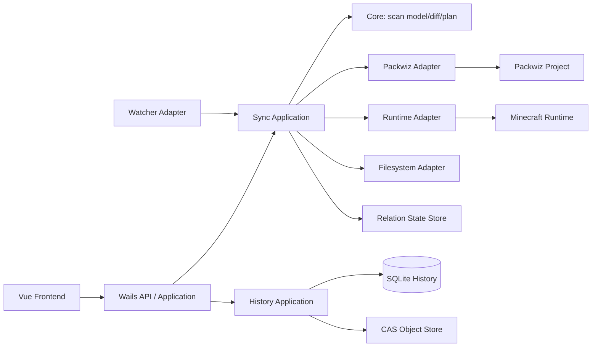
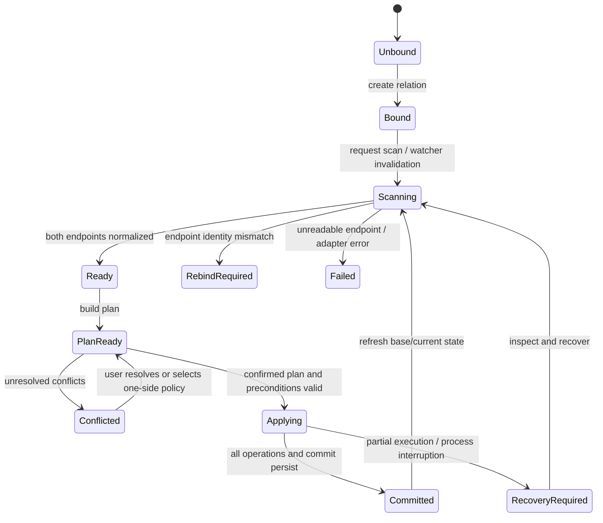
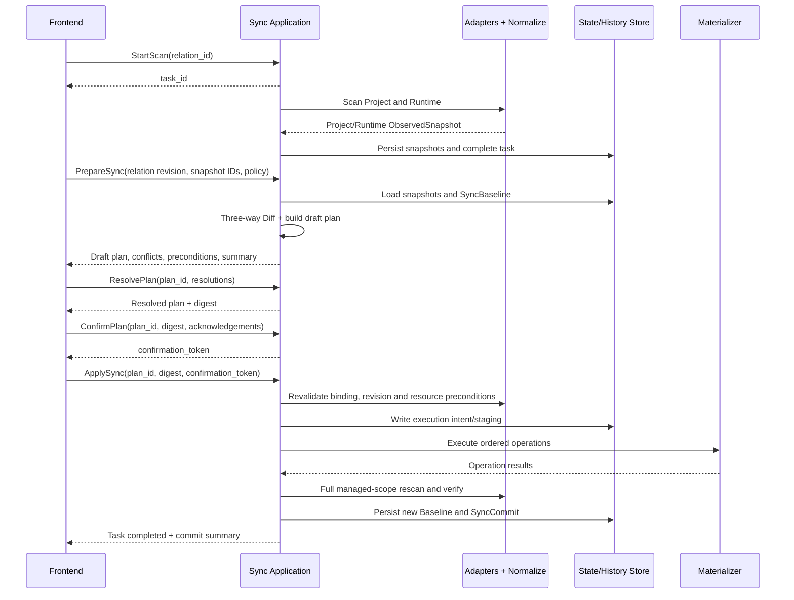

# PackGradle 目标底层架构设计

> 状态：设计基线（待实施）  
> 日期：2026-08-22  
> 本文定义后续重写的目标架构与交付边界。现有代码、旧需求文档和讨论记录仅作为迁移输入；当它们与本文冲突时，以本文为准，直至本文被显式修订。

## 0. 决策摘要

本文先固定以下架构决策，避免实现阶段再次退回旧架构的路径依赖：

1. **采用重写式演进，不以现有 Service/Store/页面边界作为新架构骨架。** 旧代码只复用经过验证的格式知识、测试 fixture、错误案例和平台能力；包结构与调用关系重新设计。
2. **Relation 是核心聚合根。** Project 与 Runtime 都是可独立登记的端点；同一 Project 可以关联多个 Runtime，每条关系拥有独立策略、基线和历史。
3. **同步核心只处理逻辑资源。** Packwiz 元数据、Runtime JAR、配置文件和脚本先被适配器归一为 `LogicalResource`，核心不比较两个目录树是否“长得一样”。
4. **写操作必须经过 `Scan -> Diff -> Prepare -> Apply -> Verify -> Commit`。** 前端和适配器都不能绕过计划直接执行跨端覆盖。
5. **SQLite 是唯一元数据权威。** Relation、观察快照、同步基线、计划、任务、执行日志、Commit 和对象引用都进入一个本机 SQLite 数据库；JSON 只用于导入导出、诊断或可丢弃缓存。
6. **CAS 是唯一可恢复内容权威。** 文本与政策允许的小型二进制按 SHA-256 存入全局内容寻址对象库；mod JAR 默认只保存可重新获取的身份与 hash。
7. **本地状态不进入 Project。** 数据库、CAS、staging、日志和机器路径全部存放在用户数据目录，不创建项目内 `.packgradle` 状态目录。
8. **MVP 只保证 copy-based 隔离同步。** Junction 和硬链接是后续可选物化能力；启用后必须降低独立 Diff、冲突和回滚能力声明。
9. **事件不是事实源。** 事件只通知任务进度或状态失效；前端必须通过查询 API 恢复权威状态。
10. **未实现能力不出现在产品操作面。** 后端通过 capability 返回阶段能力，前端不以永久禁用按钮或模拟成功占位。

### 0.1 重写与复用策略

允许复用：

- Packwiz、Prism 与 Minecraft 文件格式的已验证解析规则；
- 路径穿越、跨卷、Junction/硬链接所有权等已发现的安全案例；
- 可重复的测试 fixture、错误码语义和用户任务结论；
- 与新端口契约匹配的纯函数或平台适配实现。

默认不复用：

- 现有 Wails Service 的职责划分与方法集合；
- 以项目名、实例目录名作为主键的身份体系；
- 以 Junction/硬链接等同于同步的业务模型；
- 由页面直接组合后端命令的交互流程；
- 现有前端路由、Store 和 DTO 之间的所有权关系。

复用任何旧实现前，必须先让它实现新架构定义的 port，并通过新契约测试；不得为了“少改代码”反向修改领域模型。

## 1. 愿景、问题与非目标

### 1.1 产品愿景

PackGradle 是连接可协作的 **Packwiz Project** 与本机可运行的 **Minecraft Runtime** 的本地状态协调器。

- Git 管理可协作的 Packwiz 源码、配置和声明式 mod 元数据。
- Prism Launcher（以及未来适配器支持的启动器）管理实际运行实例。
- PackGradle 将两侧文件和 mod 元数据归一为逻辑资源，计算差异、生成可审查的同步计划、执行同步，并保留可恢复的本地历史。

```text
Git <-> Packwiz Project <-> PackGradle <-> Minecraft Runtime <-> Launcher
       collaboration source      local state      runnable files
```

项目目录与 Runtime 必须能独立存在。PackGradle 管理它们之间的一条或多条本地关系（Relation），而不是把两侧当作同一目录树的镜像。

### 1.2 核心问题

1. Packwiz 的 `mods/*.pw.toml` 与 Runtime 的 `mods/*.jar` 是同一个逻辑 mod 的不同表示，不能按路径直接覆盖。
2. 项目侧和 Runtime 侧都可能被修改；同步必须基于共同基线检测双端修改和冲突。
3. 运行环境中存在本地、二进制和启动器特有文件，不能默认写回 Git 项目。
4. 用户需要预览、确认、追溯和回滚本地同步，而不是只得到一次不可逆的文件复制结果。

### 1.3 非目标

- 不替代 Git，不实现分布式协作、远程仓库、分支或 Git merge。
- 不实现完整文件系统备份产品，也不对全部 Runtime 文件无限期保存历史。
- 不在 MVP 中实现自动三方合并、跨启动器通用 Runtime、mod 下载器或云同步。
- 不把 Junction、硬链接、复制等具体文件系统技巧定义为同步模型本身。
- 不承诺恢复无法重新获得的 mod JAR；对这类对象必须明确报告恢复能力限制。

## 2. 架构原则

1. **逻辑资源优先于路径。** 同步比较的是 `mod:create`、`file:config/foo.toml` 等资源，不是两个绝对路径字符串。
2. **先读取与计划，后写入。** Scan、Normalize、Diff、Plan 与 Apply 是分离操作；任何写入必须来自用户已确认、且仍满足前置条件的计划。
3. **共同基线是双向同步的前提。** 无 SyncBaseline 时只能执行明确的初始化计划，不能声称安全的双向合并。
4. **本机状态不污染协作仓库。** ObservedSnapshot、SyncBaseline、历史数据库、对象与 Runtime 关系默认存放在用户数据目录；项目目录只保存 Packwiz/Git 应管理的内容。
5. **可恢复文本优先，二进制按引用恢复。** 用户编辑的文本文件可进入内容寻址对象存储；mod JAR 默认只记录 Packwiz/下载 identity、版本与 hash。
6. **不可判定就显式冲突。** 不以猜测覆盖用户数据；未知格式、双端修改、身份不唯一和前置条件失效都进入可见冲突或失败状态。
7. **核心纯净，适配器可替换。** 领域模型、diff 和 plan 不依赖 Wails、Vue、Prism、Packwiz CLI 或 Windows API。
8. **一次同步是可审计提交。** 成功 Apply 才产生 `SyncCommit`；失败也保留可诊断执行记录，但不伪造成功提交。

## 3. 术语与领域模型

| 术语 | 定义 |
| --- | --- |
| Project | 一个 Packwiz 项目根目录及其声明式内容。 |
| Runtime | 一个可运行的 Minecraft 实例；MVP 的适配器为 Prism。 |
| Relation | 一条本机 Project <-> Runtime 关系，拥有稳定 `relation_id`、策略与历史。 |
| Representation | 某逻辑资源在某一侧的路径、格式和可读取状态。 |
| LogicalResource | 可比较、可计划的逻辑对象，如 mod、文本文件、目录清单或 Runtime-only 文件。 |
| ObservedSnapshot | 一次只读扫描得到的某一侧事实，包含端点绑定证据、内容 revision、资源状态、诊断与 scanner 版本；它不是已同步承诺。 |
| SyncBaseline | 上次成功 Apply 并复扫验证后，双方认可的逐资源逻辑状态；是下一次三方 Diff 的 base。 |
| Change | 某一资源相对于 base 的状态变化。 |
| SyncPlan | 无副作用的计划，含操作、冲突、前置条件和影响摘要。 |
| SyncCommit | 成功应用后的不可变历史记录，引用验证后的双端 ObservedSnapshot、前后 SyncBaseline 与恢复对象；计划输入快照通过 plan 追溯。 |
| CAS | 内容寻址对象存储（Content-addressed Storage），按内容 hash 去重保存可恢复对象。 |
| Workspace | 前端对 Relation 及其当前扫描、差异、计划、任务和历史的产品投影；不是独立后端实体。 |

### 3.1 资源分类

MVP 只支持下列资源类别，扫描器必须明确标记不支持或忽略的类别：

| Kind | Project 表示 | Runtime 表示 | 默认策略 |
| --- | --- | --- | --- |
| `mod` | `mods/*.pw.toml` + `index.toml` | `mods/*.jar` + Launcher/PackGradle meta | Packwiz 语义比较；由计划决定拉取/推送。 |
| `text_file` | 配置、脚本、KubeJS 等 | 对应 Runtime 文件 | hash 比较；MVP 冲突不自动合并。 |
| `binary_file` | 显式受管文件 | 对应 Runtime 文件 | hash 比较；双端修改为冲突。 |

`directory_manifest` 是扫描器对受管文件集合的派生索引，不进入 `LogicalResource`、Baseline 或 Diff；`runtime_local` 是排除诊断分类，不是可同步资源。二者不得伪装成可操作的 ResourceKind。

### 3.2 关键 Go 模型

```go
type ResourceKind string

const (
    ResourceMod        ResourceKind = "mod"
    ResourceTextFile   ResourceKind = "text_file"
    ResourceBinaryFile ResourceKind = "binary_file"
)

type ResourceID string // e.g. "mod:create" or "file:config/jei/jei-client.ini"

type ContentRef struct {
    Algorithm string `json:"algorithm"` // MVP: sha256
    Digest    string `json:"digest"`
    Size      int64  `json:"size"`
}

type Representation struct {
    RelativePath string            `json:"relative_path"`
    Format       string            `json:"format"`
    Content      *ContentRef       `json:"content,omitempty"`
    Metadata     map[string]string `json:"metadata,omitempty"`
}

type LogicalResource struct {
    ID       ResourceID      `json:"id"`
    Kind     ResourceKind    `json:"kind"`
    Project  *Representation `json:"project,omitempty"`
    Runtime  *Representation `json:"runtime,omitempty"`
    PolicyID string          `json:"policy_id"`
}
```

资源 ID 必须由适配器的稳定 identity 生成，而非用户可改显示名。mod 优先使用 Packwiz 元数据中的来源 identity；没有可靠来源 identity 时使用受规范化路径保护的本地 ID，并将其标记为低置信度，禁止自动匹配到不同路径的 JAR。

### 3.3 三类状态对象的关系

```text
Project Scan  -> Project ObservedSnapshot ----\
                                             +-> Three-way Diff -> SyncPlan
Runtime Scan  -> Runtime ObservedSnapshot ----/          ^
                                                        |
                                                  SyncBaseline

Apply + Verify -> new SyncBaseline -> SyncCommit
```

- `ObservedSnapshot` 可频繁生成、可被任务取消、可因文件继续变化而过期。
- `SyncBaseline` 只能在 Apply 后复扫验证成功时创建；失败、取消或仅预览不得推进。
- `SyncCommit` 记录“为什么以及如何从旧 Baseline 变成新 Baseline”，而不是充当文件备份本身。
- 用户在 resolved plan 中预先选择 `skip` 时，允许产生 `completeness=partial` 的 Commit：只更新所有已选且成功验证的资源；跳过或仍冲突的资源继续沿用旧 Baseline，并保持 Relation 为 dirty/conflicted。
- 任一已选操作执行或验证失败时，不创建 Commit、不推进任何 Baseline，整个任务进入 `recovery_required`；“部分执行成功”不是 partial Commit。

### 3.4 MappingPolicy

Relation 通过版本化 `MappingPolicy` 定义受管范围和语义，不通过“扫描到什么就同步什么”隐式扩大写入边界。

```go
type MappingRule struct {
    ID                 string   `json:"id"`
    ResourceKind       string   `json:"resource_kind"`
    ProjectPrefix      string   `json:"project_prefix"`
    RuntimePrefix      string   `json:"runtime_prefix"`
    Include            []string `json:"include,omitempty"`
    Exclude            []string `json:"exclude,omitempty"`
    Direction          string   `json:"direction"`      // bidirectional/project_to_runtime/runtime_to_project/ignore
    Materialization    string   `json:"materialization"` // copy by default
    MergePolicy        string   `json:"merge_policy"`    // manual/text_diff3/toml_semantic/packwiz
    RuntimeLocalPolicy string   `json:"runtime_local"`   // exclude/report
}

type MappingPolicy struct {
    SchemaVersion int           `json:"schema_version"`
    PolicyID      string        `json:"policy_id"`
    Revision      int           `json:"revision"`
    Rules         []MappingRule `json:"rules"`
}
```

规则要求：

- `mods` 使用语义适配器，不依赖普通目录前缀匹配；
- `config`、`kubejs`、`scripts`、`defaultconfigs` 可由模板建议，但用户确认前不进入受管范围；
- include/exclude 使用 root-relative slash glob，编译后必须证明不会越过端点 root；
- 多条规则命中同一逻辑资源时按显式优先级/更具体路径决议；无法唯一决议即产生 `mapping_collision`，不得取“最后一条”；
- 修改 Policy 会递增 Relation revision，使旧 Plan 立即 stale；
- direction 是自动建议边界，不取消 Preview、确认和前置校验。

## 4. 上下文边界与目录结构

### 4.1 目标上下文



### 4.2 后端建议目录

目录名表达目标职责，不绑定现有实现路径；实际落地可在 `internal/` 下采用同等边界。

```text
internal/
  core/
    model/          # Relation, LogicalResource, ObservedSnapshot, SyncBaseline, Change, Plan, Commit
    normalize/      # resource identity and canonical state
    diff/           # two-way and three-way comparison
    plan/           # deterministic plan builder and preconditions
    merge/          # interfaces and later merge adapters
  application/
    project/        # project registration and discovery use cases
    runtime/        # runtime discovery/creation use cases
    sync/           # scan, preview, apply, recovery orchestration
    history/        # commit listing, restore planning and GC use cases
    task/           # task lifecycle and event publication
  adapters/
    packwiz/        # project scanner, metadata identity, CLI integration
    prism/          # Prism runtime scanner/materializer
    filesystem/     # hashing, atomic writes, copy/link implementation
    watcher/        # fsnotify and debounce, no domain decisions
    junction/       # optional Windows materialization capability
  store/
    relationstate/  # current relation config, base snapshot and hash cache
    historysqlite/  # SQLite repository
    objectstore/    # content-addressed object storage
  transport/
    wails/          # DTO conversion, Wails services/events only
```

### 4.3 依赖约束

```text
transport -> application -> core
application -> adapters, store
adapters -> core model interfaces
store -> core model interfaces
core -> Go standard library only
```

`core` 不能 import Wails、SQL driver、fsnotify 或 Launcher/Packwiz 类型。具体文件路径、子进程、数据库和事件总线属于外围实现。

### 4.4 应用层接口边界

Wails transport 只暴露用例 DTO；应用层通过接口编排，禁止把适配器或文件系统句柄泄漏给前端。

```go
type SyncApplication interface {
    PrepareRelation(ctx context.Context, input PrepareRelationInput) (RelationPreparationView, error)
    CreateRelation(ctx context.Context, preparationID string) (RelationView, error)
    PrepareRebind(ctx context.Context, relationID string, input EndpointBindingInput) (RebindPreparationView, error)
    ApplyRebind(ctx context.Context, preparationID string) (RelationView, error)
    ListWorkspaces(ctx context.Context, page PageRequest) (WorkspacePage, error)
    GetWorkspace(ctx context.Context, relationID string) (WorkspaceView, error)
    StartScan(ctx context.Context, relationID string) (TaskView, error)
    PrepareSync(ctx context.Context, input PrepareSyncInput) (SyncPlanView, error)
    ResolvePlan(ctx context.Context, input ResolvePlanInput) (SyncPlanView, error)
    ConfirmPlan(ctx context.Context, planID, planDigest string, acknowledgements []string) (ConfirmationView, error)
    ApplySync(ctx context.Context, input ApplySyncInput) (TaskView, error)
    GetPlan(ctx context.Context, planID string) (SyncPlanView, error)
    GetTask(ctx context.Context, taskID string) (TaskView, error)
    ListTasks(ctx context.Context, filter TaskFilter, page PageRequest) (TaskPage, error)
    CancelTask(ctx context.Context, taskID string) error
    ListRecoveries(ctx context.Context, relationID string) ([]RecoveryView, error)
    GetRecovery(ctx context.Context, recoveryID string) (RecoveryView, error)
    ResumeRecovery(ctx context.Context, recoveryID string) (TaskView, error)
    CompensateRecovery(ctx context.Context, recoveryID string) (TaskView, error)
    AcknowledgeRecovery(ctx context.Context, recoveryID string) error
}

type HistoryApplication interface {
    ListCommits(ctx context.Context, relationID string, page PageRequest) (CommitPage, error)
    PrepareRestore(ctx context.Context, input PrepareRestoreInput) (RestorePlanView, error)
    ResolveRestorePlan(ctx context.Context, input ResolvePlanInput) (RestorePlanView, error)
    ConfirmRestorePlan(ctx context.Context, planID, planDigest string, acknowledgements []string) (ConfirmationView, error)
    ApplyRestore(ctx context.Context, planID, planDigest, confirmationToken string) (TaskView, error)
}
```

`StartScan`、`PrepareSync`、`PrepareRestore` 为无 Project/Runtime 写入用例；扫描仍会持久化 ObservedSnapshot、诊断和任务记录。`PrepareSync/PrepareRestore` 只接受已经完成的 `input_project_snapshot_id/input_runtime_snapshot_id` 及 Relation revision，不隐式启动扫描。

`PrepareSync` 产生不可变 draft plan；`ResolvePlan` 将冲突选择固化为新的不可变 resolved plan，并重新计算 digest。`ConfirmPlan` 校验用户已经确认该 plan 声明的覆盖、删除、不可恢复和共享物化风险，返回短期、单次使用且绑定 `plan_id + plan_digest + relation_revision` 的令牌。确认令牌只证明产品确认流程完成，不替代后端前置条件验证。

`ApplySync`、`ApplyRestore` 只能接收 resolved plan ID、digest 和 confirmation token，不能接收客户端指定的源路径、目标路径或删除列表。RestorePlan 与 SyncPlan 使用相同的不可变 draft/resolved、digest、acknowledgement 和 stale 规则；partial restore 选择必须在 `ResolveRestorePlan` 中固化，Apply 不接收临时 resolution。

Relation 创建与重绑定也采用 Prepare/Apply：准备阶段检查重复 pair、旧 legacy materialization、路径包含关系、端点 binding fingerprint 和将失效的 Plan；执行阶段只接受 preparation ID。重绑定不自动继承旧 Baseline，除非完整扫描能证明新端点与旧端点逻辑等价，否则进入 initialization required。

Transport DTO 必须满足：

- 顶层对象带 `schema_version`；ID、枚举和时间字段稳定；
- Go domain model 不直接作为 Wails DTO 暴露，由 transport 显式转换；
- 列表统一使用 cursor page，slice 在 transport 层归一为空数组而非 `null`；
- 调用级错误走 Promise rejection 的结构化 `AppErrorDTO`；逐项问题使用同构 `ProblemDTO`；
- 生成 bindings 只是 transport 产物，前端页面只能通过手写 `api/` 适配器访问。

## 5. 本地数据、关系与路径身份

### 5.1 默认状态位置

默认根目录为操作系统用户数据目录：

| 平台 | 默认根目录 |
| --- | --- |
| Windows | `%APPDATA%/PackGradle` |
| Linux | `$XDG_DATA_HOME/PackGradle`，未设置时回退 `~/.local/share/PackGradle` |
| macOS | `~/Library/Application Support/PackGradle` |

```text
<UserData>/PackGradle/
  packgradle.db                  # 唯一元数据权威：设置、关系、快照、计划、任务、历史、对象引用
  objects/sha256/ab/cd...        # 全局 CAS：跨 Relation 去重
  staging/<operation_id>/        # 文件系统事务日志与临时内容
  logs/                          # 结构化本地日志，按保留策略轮转
  exports/                       # 用户显式导出的诊断或策略文件
```

`packgradle.db` 与 CAS 共同组成权威本地状态：SQLite 管“对象之间的关系”，CAS 管“可恢复内容”。不得同时维护一个需要双向同步的 `current-snapshot.json` 权威副本。扫描 hash cache 可以存入 SQLite 的可丢弃表，也可以实现为独立缓存文件，但删除缓存后必须能从真实端点重建全部正确状态。

Project 工作树默认不创建 `.packgradle/`。用户若选择导出轻量协作策略文件，必须明确标明其内容不含机器路径、历史和对象；导出文件不是本机 Relation 的权威来源。

### 5.2 Relation 与端点身份

```json
{
  "schema_version": 1,
  "relation_id": "rel_01J9JZ7B3MBJY9V1X2H6DXJQ9F",
  "project": {
    "project_id": "prj_01J9JY...",
    "root_path": "D:/Projects/Collapse",
    "adapter": "packwiz",
    "binding_fingerprint": "volume-and-root-identity"
  },
  "runtime": {
    "runtime_id": "run_01J9JZ...",
    "adapter": "prism",
    "root_path": "D:/Prism/instances/Collapse/.minecraft",
    "adapter_identity": "prism-instance-key",
    "binding_fingerprint": "volume-and-instance-identity"
  },
  "policy_set": "default-v1"
}
```

- `project_id`、`runtime_id`、`relation_id` 都是在登记时生成并持久化的不可变 opaque ID；名称、路径、Git remote、pack metadata 和启动器目录名都只是属性或重绑定证据。
- `binding_fingerprint` 只包含相对稳定的绑定证据，例如卷/文件 identity、Prism adapter identity 和实例配置身份；它不包含会随正常编辑变化的文件内容 hash。
- 路径是定位信息，不是唯一 identity。每次 Scan 必须验证 binding fingerprint；路径存在但绑定证据不匹配时将 Relation 置为 `rebind_required`，不得自动把新目录当作旧端点。
- 所有输入路径必须先绝对化、清理、约束在相应 root 内，并处理大小写不敏感文件系统、junction/symlink 逃逸和卷边界。
- 正式模型允许一项目关联多个 Runtime；同一 Project/Runtime 重复关系必须阻止，除非产品以后引入明确命名的独立策略关系。

## 6. 扫描、规范化、Diff、Plan 与 Apply

### 6.1 状态机



### 6.2 Scan 与 Normalize

1. 应用层加载 Relation，并锁定该 Relation 的写操作；读取操作使用快照版本号保证一致性。
2. Project Adapter 扫描 Packwiz 结构，Runtime Adapter 扫描启动器实例。
3. Normalize 层将两侧结果转为 `LogicalResource`，统一路径分隔、内容指纹、mod identity 与资源策略。
4. Hash Cache 可在 `size + mtime + file identity` 未变时复用 hash；缓存只优化性能，不能作为事实来源。
5. 输出 `ObservedSnapshot`，其中包含 scanner version、时间、binding fingerprint、内容 `snapshot_digest`、资源表和诊断信息。

#### 6.2.1 Canonical digest 规则

为保证重复扫描和跨平台 fixture 可比较，所有 snapshot/plan/baseline digest 使用版本化 canonical 编码：

1. 记录 `normalization_version`，算法变化必须产生新版本，不能静默改变旧 digest 含义。
2. 资源按 `resource_id` 字节序排序；metadata key 排序；集合若语义无序则排序后编码。
3. 逻辑路径统一为 `/`、移除 `.`、拒绝 `..`/绝对路径；identity 使用 Relation 记录的 case policy，展示路径保留原大小写。
4. 资源适配器输出 canonical semantic object。mod digest 使用 provider identity、版本、side、期望文件 hash 等语义字段，不包含显示名或 JAR 文件名等不稳定信息。
5. 使用确定性 JSON 编码后计算 SHA-256；禁止直接对 Go map 的普通序列化结果做 hash。
6. `snapshot_id`、`captured_at`、诊断、绝对路径、缓存命中信息和 scanner implementation version 不进入内容 digest；`normalization_version` 必须进入。
7. Baseline 的 absent 状态使用显式 tombstone `{ "state": "absent" }`，不能以缺行和空 digest 混用。

`snapshot_digest` 表示受管逻辑内容 revision；`binding_fingerprint` 表示端点是否仍是原来的绑定对象。两者用途不可混用。

### 6.3 三方 Diff

当 Relation 有成功 `SyncBaseline` 时，比较 `baseline`、`project observed`、`runtime observed`：

| Project 相对 base | Runtime 相对 base | 结果 |
| --- | --- | --- |
| 未变 | 未变 | 无操作。 |
| 已变 | 未变 | 可生成 Project -> Runtime 候选操作。 |
| 未变 | 已变 | 可生成 Runtime -> Project 候选操作。 |
| 同样变为相同指纹 | 同样变 | 无操作，更新 base。 |
| 不同方式变更 | 已变 | `conflict`，除非资源类 merge adapter 能证明安全合并。 |
| 一侧删除 | 另一侧未变 | 候选删除操作，必须在预览中显式展示。 |
| 一侧删除 | 另一侧修改/新增 | `delete_modify_conflict`。 |

没有 Baseline 时：

- 两侧相同的资源可生成 `adopt_equal`，在初始化成功后纳入首个 Baseline；
- 仅一侧存在或两侧不同的资源必须由用户选择 `initialize_from_project`、`initialize_from_runtime`、`skip` 或人工处理；
- 不得把“哪侧文件较新”“哪侧数量更多”作为自动双向同步依据。

### 6.4 Plan 与 Apply 时序



`ApplySync` 不接受前端自由拼装的文件操作或冲突选择。前端只能提交 resolved `plan_id`、计划 digest 和确认令牌；后端必须重新验证计划 TTL、Relation revision、绑定证据和资源前置指纹。计划任一输入发生变化即返回 `err.sync.plan_stale`，由用户重新预览。

### 6.5 计划与操作模型

```go
type OperationKind string

const (
    OpWriteRuntime  OperationKind = "write_runtime"
    OpWriteProject  OperationKind = "write_project"
    OpRemoveRuntime OperationKind = "remove_runtime"
    OpRemoveProject OperationKind = "remove_project"
    OpMaterialize   OperationKind = "materialize"
)

type Precondition struct {
    ResourceID ResourceID  `json:"resource_id"`
    Side       string      `json:"side"`
    Expected   *ContentRef `json:"expected,omitempty"`
    Existence  string      `json:"existence"` // present/absent
}

type PlannedOperation struct {
    ID            string         `json:"id"`
    Kind          OperationKind  `json:"kind"`
    ResourceID    ResourceID     `json:"resource_id"`
    Preconditions []Precondition `json:"preconditions"`
    Reversible    bool           `json:"reversible"`
    ObjectRefs    []ContentRef   `json:"object_refs,omitempty"`
}

type ConfirmationRequirement struct {
    Code          string `json:"code"` // overwrite, delete, write_project, unrecoverable, shared_materialization
    Severity      string `json:"severity"`
    ResourceCount int    `json:"resource_count"`
}
```

Draft plan 可以包含未解决 Conflict，不能 Apply。`ResolvePlan` 不修改原 plan，而是创建 `resolved_from_plan_id` 指向原 plan 的新 resolved plan；所有 resolution 都进入新 digest。`confirmation_requirements` 由 resolved plan 的最终操作计算，前端只能提交这些 code 的 acknowledgement。

Apply 必须按可恢复顺序执行：保存必要对象 -> 在 SQLite 写入 `prepared` intent -> 创建 staging -> 执行非破坏性写入/原子替换 -> 逐项写 operation journal -> 完整复扫受管范围 -> 更新 Baseline -> 写入 Commit。失败时保留 staging 和逐项结果，进入 `RecoveryRequired`，而不是悄悄更新 Baseline。

Plan 引用 Apply 前的 `input_project_snapshot_id/input_runtime_snapshot_id`。SyncCommit 只引用 Apply 后验证得到的 `verified_project_snapshot_id/verified_runtime_snapshot_id`；输入快照通过 Plan 可追溯。MVP 不使用“局部复扫拼接成完整快照”。未来若引入增量快照，必须显式建模 `parent_snapshot_id + delta + endpoint_generation` 并证明其与完整扫描等价。

### 6.6 文件系统事务与崩溃恢复

SQLite 事务无法与任意文件系统写入形成单个原子事务，因此执行器必须使用可重放 journal，而不是假设“数据库事务包住复制文件”即可安全：

1. `prepared`：保存计划 digest、全部前置条件、恢复对象引用和有序操作清单。
2. `staged`：需要覆盖/删除的旧内容已经进入 CAS 或 staging，且 hash 已复核。
3. `applying`：每个 operation 在写入前持久化目标 root-relative path、before/after digest、临时路径、staging/CAS 引用、所有权证明与 `pending` 状态，再独立记录 `running/applied/verified/compensated/failed`。
4. `verifying`：MVP 完整复扫 Relation 受管范围，并与计划目标及未选资源的既有 Baseline 比较。局部复扫仅在增量快照一致性协议落地后允许。
5. `committed`：完整复扫验证后，在一个 SQLite 事务中写入验证快照、新 Baseline、SyncCommit、对象引用和 Relation head。
6. `recovery_required`：启动时发现未完成 journal，先阻止该 Relation 新 Apply；恢复器先 probe 实际路径与 before/after digest，再决定 mark-applied、redo、compensate 或要求人工确认。

所有文件操作必须幂等：重复执行已 `verified` 的操作不改变结果；重复恢复不得再次删除或覆盖无法证明所有权的路径。

## 7. 冲突、合并与物化策略

### 7.1 冲突策略

MVP 只提供显式选择，不提供自动文本合并：

- `take_project`：以 Project 表示覆盖 Runtime 表示。
- `take_runtime`：以 Runtime 表示覆盖 Project 表示，需额外确认其会进入 Git 工作树。
- `skip`：资源不进入本次提交，Relation 仍保持有未解决差异。
- `manual`：打开两侧路径和诊断，用户在外部编辑后重新 Scan。

后续阶段可按资源类别接入 `MergeAdapter`：

```go
type MergeAdapter interface {
    Supports(resource LogicalResource) bool
    Merge(base, project, runtime Representation) (MergedRepresentation, ConflictDetails, error)
}
```

- TOML：解析后的结构合并仅在语义规则明确时启用；不能因键顺序变化生成误导性冲突。
- KubeJS/脚本：可使用文本三方合并，但存在冲突标记时不得自动写入可运行 Runtime。
- Packwiz mod：使用 Packwiz 语义及来源 identity；不按 jar 文件名推断安全替换。
- 二进制和未知格式：始终冲突。

### 7.2 Junction/硬链接/复制

物化（Materialization）是 Apply 中可选的一步，不是资源同步的替代品：

| 策略 | 使用条件 | 好处 | 限制 |
| --- | --- | --- | --- |
| `copy` | 默认、跨卷、安全边界清晰 | 独立、可快照、行为直观 | 占用空间。 |
| `hardlink` | 同卷、文件受控、身份可验证 | 节省空间 | 不适用于目录；外部修改会绕过独立状态。 |
| `junction` | Windows、完整受管目录、明确共享意图 | 零拷贝目录工作流 | 无法排除子项；会削弱双端差异含义。 |

MVP 的核心 Sync 只保证 `copy` 路径。硬链接/Junction 的支持必须以 capability 声明、身份校验、解除物化与回退为前提，且 UI 必须显示“共享而非复制”的后果。对已物化为共享路径的资源，扫描器应标记为 `shared_materialization`，避免制造虚假的双端独立修改结论。

## 8. ObservedSnapshot、SyncBaseline、SyncCommit、CAS 与 SQLite

### 8.1 观察快照与同步基线

```json
{
  "schema_version": 1,
  "snapshot_id": "snap_01J9...",
  "relation_id": "rel_01J9...",
  "side": "project",
  "captured_at": "2026-08-22T14:00:00Z",
  "binding_fingerprint": "volume-and-root-identity",
  "snapshot_digest": "sha256:...",
  "scanner": {"name": "packwiz", "version": "1"},
  "resources": {
    "file:config/jei/jei-client.ini": {
      "kind": "text_file",
      "representation": {
        "relative_path": "config/jei/jei-client.ini",
        "format": "toml",
        "content": {"algorithm": "sha256", "digest": "...", "size": 120}
      }
    }
  },
  "diagnostics": []
}
```

`ObservedSnapshot` 是单侧不可变扫描结果。`SyncBaseline` 不重复保存整份文件内容，而是按 `resource_id` 保存上次认可的逻辑指纹、两侧表示引用和可恢复性：

```json
{
  "baseline_id": "base_01J9...",
  "relation_id": "rel_01J9...",
  "parent_baseline_id": "base_01J8...",
  "resources": {
    "file:config/jei/jei-client.ini": {
      "logical_digest": "sha256:...",
      "project_representation": {
        "relative_path": "config/jei/jei-client.ini",
        "format": "toml",
        "content": {"algorithm": "sha256", "digest": "...", "size": 120}
      },
      "runtime_representation": {
        "relative_path": "config/jei/jei-client.ini",
        "format": "toml",
        "content": {"algorithm": "sha256", "digest": "...", "size": 120}
      },
      "recoverability": "cas"
    }
  }
}
```

观察快照、基线和 Commit 都存入 SQLite 并保持不可变；Relation 只移动自己的 `head_baseline_id/head_commit_id`。可丢弃扫描缓存不属于历史链。

### 8.2 CAS 职责

CAS 仅保存恢复所需且政策允许保存的内容：

- key 为内容 hash，value 为原子写入的文件内容；同内容天然去重。
- SQLite 只保存对象引用，不重复保存 blob。
- 对象写入完成、hash 复算验证后才可被 Commit 引用。
- GC 依据所有未删除 Commit、staging 与保留策略中的引用图执行；GC 永远不删除未完成 staging 引用的对象。
- mod JAR 默认不入 CAS。Commit 保存其 Packwiz identity、版本、下载源、期望 hash 和“可重新获取”状态。

### 8.3 SQLite 职责与示例 schema

SQLite 管理设置、端点、关系、映射、观察快照、同步基线、计划、冲突、任务、执行 journal、提交图、对象引用和恢复记录；不承担大对象存储。数据库启用 `foreign_keys=ON`、`journal_mode=WAL`、`synchronous=FULL` 和合理的 `busy_timeout`，并用 `PRAGMA user_version` 驱动向前迁移。应用启动时使用 SQLite Online Backup API 或 `VACUUM INTO` 生成一致备份后再迁移，不能在 WAL 活跃时直接复制单个 `.db` 文件；迁移失败不得启动写操作。应用正常关闭和备份前执行受控 checkpoint，但不能依赖 checkpoint 代替事务持久性。

```sql
CREATE TABLE projects (
  id TEXT PRIMARY KEY,
  adapter TEXT NOT NULL,
  display_name TEXT NOT NULL,
  root_path TEXT NOT NULL,
  binding_fingerprint TEXT NOT NULL,
  created_at TEXT NOT NULL,
  UNIQUE(adapter, root_path)
);

CREATE TABLE runtimes (
  id TEXT PRIMARY KEY,
  adapter TEXT NOT NULL,
  display_name TEXT NOT NULL,
  root_path TEXT NOT NULL,
  adapter_identity TEXT NOT NULL,
  binding_fingerprint TEXT NOT NULL,
  created_at TEXT NOT NULL,
  UNIQUE(adapter, adapter_identity)
);

CREATE TABLE relations (
  id TEXT PRIMARY KEY,
  project_id TEXT NOT NULL REFERENCES projects(id),
  runtime_id TEXT NOT NULL REFERENCES runtimes(id),
  policy_set TEXT NOT NULL,
  revision INTEGER NOT NULL DEFAULT 1,
  health TEXT NOT NULL,
  head_baseline_id TEXT NULL REFERENCES sync_baselines(id),
  head_commit_id TEXT NULL REFERENCES sync_commits(id),
  created_at TEXT NOT NULL,
  UNIQUE(project_id, runtime_id)
);

CREATE TABLE observed_snapshots (
  id TEXT PRIMARY KEY,
  relation_id TEXT NOT NULL REFERENCES relations(id),
  side TEXT NOT NULL CHECK(side IN ('project', 'runtime')),
  binding_fingerprint TEXT NOT NULL,
  scanner_name TEXT NOT NULL,
  scanner_version TEXT NOT NULL,
  captured_at TEXT NOT NULL,
  snapshot_digest TEXT NOT NULL
);

CREATE TABLE resource_representations (
  snapshot_id TEXT NOT NULL REFERENCES observed_snapshots(id),
  resource_id TEXT NOT NULL,
  resource_kind TEXT NOT NULL,
  relative_path TEXT NOT NULL,
  format TEXT NOT NULL,
  content_digest TEXT NULL,
  size INTEGER NULL,
  semantic_json TEXT NOT NULL,
  PRIMARY KEY(snapshot_id, resource_id)
);

CREATE TABLE sync_baselines (
  id TEXT PRIMARY KEY,
  relation_id TEXT NOT NULL REFERENCES relations(id),
  parent_id TEXT NULL REFERENCES sync_baselines(id),
  created_at TEXT NOT NULL,
  baseline_digest TEXT NOT NULL
);

CREATE TABLE baseline_resources (
  baseline_id TEXT NOT NULL REFERENCES sync_baselines(id),
  resource_id TEXT NOT NULL,
  logical_digest TEXT NOT NULL,
  project_representation_json TEXT NULL,
  runtime_representation_json TEXT NULL,
  recoverability TEXT NOT NULL,
  PRIMARY KEY(baseline_id, resource_id)
);

CREATE TABLE sync_plans (
  id TEXT PRIMARY KEY,
  relation_id TEXT NOT NULL REFERENCES relations(id),
  kind TEXT NOT NULL CHECK(kind IN ('initialize', 'sync', 'restore')),
  resolved_from_plan_id TEXT NULL REFERENCES sync_plans(id),
  base_baseline_id TEXT NULL REFERENCES sync_baselines(id),
  input_project_snapshot_id TEXT NOT NULL REFERENCES observed_snapshots(id),
  input_runtime_snapshot_id TEXT NOT NULL REFERENCES observed_snapshots(id),
  target_commit_id TEXT NULL REFERENCES sync_commits(id),
  target_baseline_id TEXT NULL REFERENCES sync_baselines(id),
  requested_exactness TEXT NOT NULL CHECK(requested_exactness IN ('exact', 'allow_partial')),
  relation_revision INTEGER NOT NULL,
  plan_digest TEXT NOT NULL,
  status TEXT NOT NULL CHECK(status IN ('draft', 'resolved', 'confirmed', 'applied', 'expired', 'stale')),
  expires_at TEXT NOT NULL,
  plan_json TEXT NOT NULL
);

CREATE TABLE tasks (
  id TEXT PRIMARY KEY,
  relation_id TEXT NULL REFERENCES relations(id),
  kind TEXT NOT NULL,
  status TEXT NOT NULL,
  phase TEXT NOT NULL,
  sequence INTEGER NOT NULL DEFAULT 0,
  outcome TEXT NULL CHECK(outcome IN ('exact', 'partial')),
  can_cancel INTEGER NOT NULL DEFAULT 0,
  created_at TEXT NOT NULL,
  updated_at TEXT NOT NULL,
  problem_json TEXT NULL
);

CREATE TABLE operation_journal (
  task_id TEXT NOT NULL REFERENCES tasks(id),
  operation_id TEXT NOT NULL,
  ordinal INTEGER NOT NULL,
  status TEXT NOT NULL,
  target_relative_path TEXT NOT NULL,
  before_digest TEXT NULL,
  after_digest TEXT NULL,
  temp_relative_path TEXT NULL,
  recovery_ref_json TEXT NULL,
  ownership_proof_json TEXT NOT NULL,
  operation_json TEXT NOT NULL,
  result_json TEXT NULL,
  PRIMARY KEY(task_id, operation_id),
  UNIQUE(task_id, ordinal)
);

CREATE TABLE sync_commits (
  id TEXT PRIMARY KEY,
  relation_id TEXT NOT NULL REFERENCES relations(id),
  parent_id TEXT NULL REFERENCES sync_commits(id),
  created_at TEXT NOT NULL,
  plan_id TEXT NOT NULL REFERENCES sync_plans(id),
  verified_project_snapshot_id TEXT NOT NULL REFERENCES observed_snapshots(id),
  verified_runtime_snapshot_id TEXT NOT NULL REFERENCES observed_snapshots(id),
  previous_baseline_id TEXT NULL REFERENCES sync_baselines(id),
  result_baseline_id TEXT NOT NULL REFERENCES sync_baselines(id),
  commit_kind TEXT NOT NULL CHECK(commit_kind IN ('initialize', 'sync', 'restore')),
  completeness TEXT NOT NULL CHECK(completeness IN ('exact', 'partial')),
  remaining_change_count INTEGER NOT NULL DEFAULT 0,
  summary_json TEXT NOT NULL
);

CREATE TABLE commit_changes (
  commit_id TEXT NOT NULL REFERENCES sync_commits(id),
  resource_id TEXT NOT NULL,
  change_kind TEXT NOT NULL,
  project_before TEXT NULL,
  project_after TEXT NULL,
  runtime_before TEXT NULL,
  runtime_after TEXT NULL,
  PRIMARY KEY (commit_id, resource_id)
);

CREATE TABLE objects (
  algorithm TEXT NOT NULL,
  digest TEXT NOT NULL,
  size INTEGER NOT NULL,
  state TEXT NOT NULL CHECK(state IN ('staging', 'ready', 'quarantined')),
  created_at TEXT NOT NULL,
  PRIMARY KEY (algorithm, digest)
);

CREATE TABLE object_refs (
  owner_type TEXT NOT NULL,
  owner_id TEXT NOT NULL,
  algorithm TEXT NOT NULL,
  digest TEXT NOT NULL,
  purpose TEXT NOT NULL,
  size INTEGER NOT NULL,
  PRIMARY KEY (owner_type, owner_id, algorithm, digest, purpose),
  FOREIGN KEY (algorithm, digest) REFERENCES objects(algorithm, digest)
);
```

生产 schema 还应包含 `mappings`、`conflicts`、`plan_confirmations`、`task_events`、`hash_cache` 和 `schema_migrations`。上表固定主键、引用方向和权威边界；Baseline 保存版本化 canonical representation JSON，不引用某次扫描表中的可回收行。Commit 单向引用 result Baseline，不在 Baseline 上保存反向 Commit ID。可变详情使用版本化 JSON 时，必须由 repository 层验证 schema，不能把任意 JSON 直接泄漏给应用层。

SQLite 单列 FK 仍不足以表达全部领域约束。Repository 必须在同一事务中验证并由 Store 契约测试覆盖：

- Relation 的 head Baseline/Commit、Plan 的输入 Snapshot/目标 Commit、Commit 的验证 Snapshot/前后 Baseline 全部属于同一 `relation_id`；
- `input_project_snapshot_id` 与 `verified_project_snapshot_id` 的 side 必须为 `project`，Runtime 同理；
- Restore target Commit/Baseline 必须属于当前 Relation；
- object reference 只能指向 `objects.state='ready'` 且 size/hash 复核通过的对象；
- Relation head 的移动、新 Baseline、Commit 和 object refs 必须在一个 SQLite 事务中完成。

### 8.4 回滚

“回滚某提交”不是数据库记录的反转，而是以目标历史 Baseline 生成一份新的 `RestorePlan`，同样经过 Scan、前置检查、确认和 Apply。成功恢复产生一个新的 `SyncCommit`，保留完整审计链；历史记录本身不被改写。

`PrepareRestoreInput` 必须包含 `relation_id`、目标 `commit_id/baseline_id`、当前 `relation_revision`、最新双端 input snapshot IDs 与 `requested_exactness`。Restore 不能只根据历史记录直接覆盖当前文件，因为用户可能在目标 Commit 之后继续修改两侧。

RestorePlan 必须逐资源标记：

- `restorable_from_cas`：内容可直接恢复；
- `redownload_required`：需要通过 Packwiz/来源适配器重新获取并校验 hash；
- `user_object_required`：需要用户提供本地对象；
- `unrecoverable`：无法证明可以恢复，默认阻止“精确恢复”。

用户可显式选择降级恢复，但结果必须标记为 partial，不能把缺失资源写成成功恢复。

## 9. 并发、监听、任务与事件

### 9.1 锁与并发规则

- Relation 是写入串行化单位：同一 `relation_id` 同一时刻最多一个 Apply 或 Restore。
- 同一 Relation 同时最多一个 Scan Task；重复 StartScan 复用活动 task，Watcher invalidation 在活动扫描期间只合并为一次 follow-up scan。单个 Scan Task 内 Project/Runtime 扫描和文件 hash 可以有界并行。计划建立时必须包含 `relation_revision`、两侧 binding fingerprint 和输入 snapshot digest；Apply 前重新验证。
- 全局设置、关系注册表和 SQLite 连接各自有独立并发控制，不用单个全局大锁。
- 文件监听只产生“可能过期”信号，不直接修改 ObservedSnapshot、SyncBaseline 或运行同步。
- 子进程、网络与 hash 计算必须可取消、超时且具备上限；取消后不得写成功 Commit。

### 9.2 任务事件契约

后端持久化的 Task 是长操作的事实源，前端不通过推测 loading 状态判断完成。事件使用统一 envelope，并与 JSON/Wails 契约一致采用 snake_case：

```ts
export interface EventEnvelope<T> {
  schema_version: 1
  event_id: string
  event_type: 'task_updated' | 'relation_invalidated' | 'watch_failed'
  stream_sequence: number
  emitted_at: string
  relation_id?: string
  task_id?: string
  payload: T
}

export interface TaskSnapshotDTO {
  task_id: string
  relation_id?: string
  task_sequence: number
  kind: 'scan' | 'apply' | 'restore' | 'gc'
  status: 'queued' | 'running' | 'succeeded' | 'failed' | 'cancelled' | 'recovery_required'
  outcome?: 'exact' | 'partial'
  phase: string
  completed: number
  total: number
  message_key: string
  message_args: string[]
  plan_id?: string
  commit_id?: string
  can_cancel: boolean
  created_at: string
  updated_at: string
  problem?: AppErrorDTO
}
```

`stream_sequence` 在单次应用事件流内单调递增，用于发现连接期间漏包；`task_sequence` 在单个 Task 内持久化单调递增，用于拒绝旧任务快照覆盖新状态；Relation 自身使用 `relation_revision`，三者不能混用。

事件是进度与失效通知，不是唯一事实来源。应用启动时先建立事件订阅并暂存收到的事件，再调用 `ListTasks(status=active|recovery_required)` 与工作区查询完成 bootstrap，最后按 `task_sequence/relation_revision` 合并暂存事件；这样任务在“查询与订阅之间完成”也不会丢失。若 transport 支持 replay cursor，可进一步提供原子 bootstrap snapshot + cursor。窗口重开、stream 跳号或漏事件后，通过 `ListTasks/GetTask`、`GetPlan`、`GetWorkspace` 重新读取状态。Watcher 只发送 `relation_invalidated`，不得直接发送一份被当作权威的新 Diff。

### 9.3 错误契约

后端继续只返回结构化错误码，不返回用户可见中文：

```json
{
  "code": "err.sync.plan_stale",
  "args": ["plan_01J9..."],
  "detail": "runtime snapshot digest changed"
}
```

新错误码建议按域分组：`err.relation.*`、`err.scan.*`、`err.resource.*`、`err.diff.*`、`err.sync.*`、`err.history.*`、`err.object.*`、`err.recovery.*`。前端所有文案进入 `frontend/src/locales/zh-CN.json`；`detail` 仅用于诊断与可复制输出。

## 10. 前端信息架构与状态归属

### 10.1 目标导航

```text
/workspaces                         工作区列表：健康、dirty/conflict、任务、最近提交
/workspaces/new                     选择 Project、Runtime、MappingPolicy 并创建 Relation
/workspaces/:id/changes             默认详情：资源三态、差异筛选、Prepare Sync
/workspaces/:id/mappings            受管范围、方向策略、物化能力
/workspaces/:id/plans/:plan_id      不可变计划预览、冲突选择、风险确认与 Apply
/workspaces/:id/rebind              端点重绑定预检、证据对比与确认
/workspaces/:id/history             SyncCommit 时间线
/workspaces/:id/history/:commit_id  Commit 详情与 Prepare Restore
/sources                            Packwiz Project 登记、解析与源码维护
/runtimes                           Prism Runtime 发现、登记、创建与健康检查
/settings                           适配器、凭据、存储、保留和诊断
```

默认首页为 `/workspaces`。Project 与 Runtime 页面只管理端点；所有跨端判断和写入都归工作区。关系详情使用同一工作区壳层，tab 是否出现由 feature 决定，不为未来能力预放永久禁用页面。

创建流程固定为：选择/登记 Project -> 选择/登记 Runtime -> 选择 MappingPolicy -> 创建 Relation -> StartScan -> 生成初始化 Plan。冲突选择属于具体 `plan_id`，生成新 Plan 或重新 Scan 后旧草稿失效，不能自动迁移到新计划。

### 10.2 前端状态边界

| 状态 | 所有者 | 规则 |
| --- | --- | --- |
| Relation、ObservedSnapshot、SyncBaseline、Plan、Commit、Task | 后端 | 后端为权威，前端仅缓存和展示。 |
| 路由、展开项、过滤、列排序、对话框是否打开 | 前端 | 可保存在本地 UI state。 |
| 用户尚未提交的冲突选择 | 前端草稿 + 后端校验 | 只提交给 `ResolvePlan/ResolveRestorePlan` 生成新 resolved plan；Apply 不接收 resolution。 |
| i18n 文案 | 前端 locale | 后端只提供稳定 code/args。 |

计划页必须让用户看见：源侧、目标侧、资源数、创建/修改/删除数、不可恢复风险、冲突数和物化后果。MVP 不展示“自动合并成功”入口，因为该能力尚未实现。

### 10.3 前端模块所有权

```text
frontend/src/
  api/                 # 手写 transport adapter；屏蔽生成 bindings 的 null/事件/错误细节
  modules/
    workspaces/        # registry, detail, changes, mappings, conflicts
    plans/             # preview, confirmation, stale-plan recovery
    history/           # commit list/detail, restore preview
    tasks/             # backend task mirror and reconnect
    sources/           # Packwiz Project endpoint management
    runtimes/          # Runtime endpoint management
  shared/              # 稳定跨模块组件、错误/i18n、布局
```

每个后端对象只保留一个权威前端 cache：

- `workspaceRegistry`：列表摘要，key 为 `relation_id`；
- `workspaceDetail`：当前工作区、features 与 action availability，key 为 `relation_id + revision`；
- `workspaceChanges`：某次 project/runtime snapshot pair 的 Diff；
- `planStore`：不可变 plan，key 为 `plan_id`；
- `planDraftStore`：用户尚未提交的 resolution/acknowledgement，严格按 `plan_id` 隔离；
- `taskStore`：后端 Task 镜像，按 `task_sequence` 合并；
- `historyStore`：分页 Commit 与详情。

页面不得自行拼接 Project store、Runtime store 和事件包推断“已同步”。收到 invalidation 后只把相关 cache 标记 stale，并触发受控重查。

### 10.4 Feature 与操作可用性

```ts
export interface WorkspaceFeatures {
  scan: boolean
  sync_preview: boolean
  sync_apply: boolean
  conflict_inspection: boolean
  conflict_resolution: 'none' | 'choose_side' | 'merge'
  history_view: boolean
  restore_preview: boolean
  restore_apply: boolean
  materialization_modes: Array<'copy' | 'hardlink' | 'junction'>
}

export interface ActionAvailability {
  action: 'scan' | 'prepare_sync' | 'apply_sync' | 'prepare_restore' | 'apply_restore' | 'rebind'
  available: boolean
  reason_code?: string
  reason_args?: string[]
}
```

- Feature 只表达当前版本/平台是否实现某类能力；未实现的 tab 和动作不注册。
- Action availability 表达当前 Relation 健康、任务占用、计划状态和权限是否允许执行；不可用动作显示具体原因，但历史、冲突证据和恢复诊断不能因 Runtime 离线而消失。
- Feature 与 availability 都由后端计算，前端不能根据页面数据自行推断。
- Mock 只能存在于开发构建，且必须实现完整 contract conformance test，生产构建不能让用户切换到模拟写操作。

### 10.5 工作区状态投影

工作区列表不得用“差异数为 0”推断 clean，必须返回正交状态：

```ts
export interface WorkspaceStateDTO {
  scan_state: 'never_scanned' | 'queued' | 'scanning' | 'ready' | 'failed'
  baseline_state: 'none' | 'ready' | 'stale'
  diff_state: 'unknown' | 'initialization_required' | 'clean' | 'dirty' | 'conflicted'
  relation_health: 'healthy' | 'endpoint_missing' | 'rebind_required' | 'recovery_required'
  active_task_id?: string
  relation_revision: number
}
```

只有两侧扫描成功、Baseline 有效且 Diff 明确无变化时才能显示 clean。partial Commit/Restore 后，只要仍有跳过、冲突或不可恢复资源，就必须保持 dirty/conflicted。

## 11. 安全、完整性与可观测性

### 11.1 安全与完整性

- 所有路径操作必须基于 root-relative 路径和 real path 验证；拒绝 `..`、绝对路径注入、root 外 symlink/junction 逃逸与未受控 reparse point。
- 删除、覆盖、移动和解除物化必须有后端前置检查、计划展示与前端确认。
- 只删除 PackGradle 可证明由自己创建且目标身份仍匹配的链接/文件；无法证明归属时失败并要求人工处理。
- 写入使用 staging、临时文件、fsync（平台允许时）与原子 rename；Commit 只在所有已选操作成功、完整复扫通过且 Baseline 更新规则满足时写入。用户预先 skip 可产生 partial Commit，执行失败不可。
- 数据库启用事务、外键和 schema migration；对象文件先落盘再引用，避免悬空引用。
- API Key、token 等敏感设置优先进入操作系统凭据存储；SQLite 只保存 credential reference。敏感值不进入 Relation 历史、事件 detail、计划摘要、日志或对象存储。

### 11.2 可观测性

- 每个 Scan、Plan、Apply、Restore 都有 `operation_id`，日志中贯穿 relation、资源数量、耗时、适配器版本和结果。
- 记录结构化审计：用户意图、计划 digest、确认时间、每项操作结果、恢复信息，但不记录文件内容。
- 后续提供导出诊断包：脱敏 relation 配置、任务日志、schema 版本和失败原因；不包含 CAS 内容和 API Key。
- 指标先以本地诊断汇总实现，不要求远程 telemetry：扫描耗时、hash cache 命中、冲突类型、Apply 失败原因、对象库大小。

### 11.3 非功能目标

以下是实现验收目标，不是跳过基准测试的性能承诺：

- 典型大型整合包（约 3,000 个受管资源）冷扫描目标 `<= 10s`，hash cache 命中后的热扫描目标 `<= 2s`；必须分别记录 Project、Runtime、Normalize 和 DB 写入耗时。
- UI 查询接口在不触发扫描时目标 `P95 <= 200ms`；长操作一律返回 Task，不阻塞 Wails 调用直到完成。
- 单 Relation Apply 的内存增量目标 `< 256 MiB`；大文件必须流式 hash/copy，不整文件读入内存。
- SQLite/CAS 在进程强杀、断电模拟和磁盘写满后不得推进错误 Baseline；下次启动必须检测未完成 journal。
- 未启用平台能力时，核心 Scan/Diff/Plan 在 Windows、Linux、macOS 使用相同 fixture 得到一致逻辑结果。

## 12. 测试策略与验收基线

### 12.1 测试层级

| 层级 | 重点 |
| --- | --- |
| Core 单元测试 | identity、规范化、三方 diff 真值表、计划确定性、冲突分类。 |
| Store 测试 | SQLite migration/事务、CAS 原子写/去重/GC、staging 恢复。 |
| Adapter 契约测试 | Packwiz/Prism fixture、路径安全、hash、文件物化能力。 |
| Application 集成测试 | Scan -> Plan -> Apply -> Commit -> Restore，取消与部分失败。 |
| 前端组件/流程测试 | 计划风险展示、冲突选择、确认门槛、任务重连、错误翻译。 |
| E2E（Windows） | Prism fixture、同卷/跨卷、Junction/hardlink capability、真实 Wails bindings。 |

### 12.2 必测不变量

- 相同端点和内容的重复 Scan 产生等价 ObservedSnapshot；重复 Prepare 不产生 Project/Runtime 写入。
- 相同输入和 base 产生相同 Plan digest 与操作顺序。
- Apply 前置条件失效时绝不继续写入，返回 `err.sync.plan_stale`。
- exact Commit 后 SyncBaseline 与实际双端复扫一致；partial Commit 只要求已选资源与验证快照一致，跳过资源沿用旧 Baseline，并保持 dirty/conflicted。失败不推进 Baseline。
- CAS 不能引用未完整写入对象；GC 不删除活跃 Commit/staging 引用。
- Runtime-only 文件默认不进入 Project；Project core 文件默认不被 Runtime 覆盖。
- 所有用户可见失败能映射到 `err.*` locale key。
- 任何删除/解除链接操作均验证所有权和目标 identity。

## 13. 分阶段交付与能力边界

| 阶段 | 可交付能力 | 明确不做 |
| --- | --- | --- |
| Phase 0：设计基线 | 本文、数据 schema、fixture、存储位置和 Relation identity 决策。 | 不更改用户同步行为。 |
| Phase 1：MVP 只读核心 | SQLite 初始 schema、端点/Relation 登记、Project/Prism 扫描、LogicalResource、ObservedSnapshot、SyncBaseline 初始化计划、三方 Diff、只读计划预览。 | 不写 Project/Runtime 文件、不自动合并、不提供历史回滚。 |
| Phase 2：MVP 可控同步 | 单向初始化、显式冲突选择、copy 物化、覆盖前文本/CAS 对象留存、journaled Apply、任务事件、复扫验证、首个 SyncCommit。 | Junction/hardlink 默认支持、自动 merge、历史状态恢复 UI。 |
| Phase 3：历史恢复 | RestorePlan/ApplyRestore、对象保留/GC、恢复可用性说明、用户对象补全与崩溃恢复工具。 | 保存所有 JAR、任意时点无条件恢复。 |
| Phase 4：增强适配 | TOML/文本 merge adapter、广义 watcher、可选 hardlink/Junction capability、更多 Runtime adapters。 | 不承诺所有文件格式自动合并。 |

每个阶段结束必须保留上一阶段已支持的只读诊断能力。未到达 Phase 2 前，界面不得暗示“同步已完成”；未到达 Phase 3 前，界面不得提供“可回滚”承诺。

Phase 1 的 Plan 在产品中称为“同步分析”或“初始化预览”，页面没有完成型主按钮。Phase 2 产生 Commit 后即可开放只读 History；`history_view` 与 `restore_preview/restore_apply` 是独立 Feature，不能因为尚未支持 Restore 而隐藏已存在的审计历史。

### 13.1 阶段退出条件

**Phase 1**

- Core 三方 Diff 真值表、identity fixture 和路径安全测试通过；
- 同一输入重复扫描得到相同 snapshot digest，热扫描能证明 hash cache 命中；
- 前端只能查看工作区、扫描、差异和计划，不存在 Apply/History/Restore 入口；
- 删除数据库中的可丢弃扫描缓存后，可从端点重建同等 ObservedSnapshot。

**Phase 2**

- 覆盖、删除前的旧内容按 recoverability policy 完成 staging；
- 声称 `recoverability=cas` 的文本对象已经写入 CAS 并持久化引用，staging 清理不影响未来 Restore；
- plan stale、取消、写满磁盘、进程强杀、部分操作失败都不会推进 Baseline；
- exact Apply 成功后复扫结果与新 Baseline 一致；partial Apply 仅更新已选资源并保留未选差异，二者都生成带明确 completeness 的可查询 SyncCommit；
- 前端刷新或重启后能从 Task/Workspace 查询恢复真实状态。

**Phase 3**

- 任一声称可恢复的文本资源均可从 CAS 验证并恢复；
- RestorePlan 清楚区分 CAS、重新下载、用户提供和不可恢复资源；
- GC 不删除活跃 Commit、Baseline、Plan 或 staging 引用；
- 降级恢复不会被标记为 exact success。

## 14. 迁移与弃用策略

迁移只迁移用户数据与已验证行为，不迁移旧架构边界。建议在同一仓库中建立独立的新应用入口/模块树，旧应用进入功能冻结；不要一边重写核心、一边继续向旧 Service 和页面追加新能力。

1. **并行读取，不原地覆盖。** 独立 `legacy-import` 适配器将旧项目/实例关联识别为候选 Relation，生成迁移预览；不自动删除旧配置、链接或文件。
2. **一次关系一次迁移。** 用户选择 Project、Runtime、MappingPolicy 和初始化方向后创建新 Relation；成功完成初始化 Apply、复扫与首个 Baseline/Commit 后才标记迁移完成。
3. **旧链接不是新同步策略。** 已存在的 Junction、硬链接和文件级链接只作为 `legacy_shared` 实态被识别；必须先解除、保留为明确共享模式或由用户选择复制物化，不能与同资源的新 copy 同步同时生效。
4. **一次性导入优先于长期兼容层。** Legacy reader 只负责读旧格式并生成新模型输入；新核心不调用旧 Service，也不在 domain 中保留旧 DTO 字段。
5. **前端整页切换。** 新工作区流程达到阶段验收后替换对应旧入口，不在同一页面混用旧命令和新 Plan/Task 语义。
6. **可逆弃用。** 在明确的废弃版本前保留只读旧配置导入和解除 legacy link 工具；删除旧配置必须单独确认并验证链接归属。
7. **数据演进。** SQLite schema、CAS layout 和导入格式各自有 `schema_version` 与 migrate/backup 机制；升级失败必须保留原数据且给出恢复路径。

### 14.1 推荐工程切换方式

```text
legacy application (feature frozen)
          |
          +-- read-only import fixtures/tests
          v
new domain + ports -> headless integration harness -> new Wails transport -> new frontend
```

优先让新核心通过 headless 集成测试完成 `Scan/Diff/Plan/Apply/Recover`，再接 Wails 和产品 UI。这样前端契约来自已稳定的应用用例，而不是在页面开发过程中反推后端模型。

## 15. ADR 基线与开放决策

### 15.1 已固定的 ADR 基线

| ADR | 决策 |
| --- | --- |
| ADR-001 | Relation 正式支持一个 Project 对多个 Runtime；每个 Project/Runtime pair 至多一条默认 Relation。 |
| ADR-002 | Project、Runtime、Relation 使用登记时生成的 opaque ID；路径、名称、Git remote 和 pack metadata 不是主键。 |
| ADR-003 | 受管范围必须由 MappingPolicy 明确声明；可提供 `config/kubejs/scripts/defaultconfigs` 模板，但用户确认前不写入。 |
| ADR-004 | Runtime 写回 Project 时检查 Git 状态并展示风险，但 MVP 不以 dirty worktree 作为硬阻断；删除和覆盖仍需计划确认。 |
| ADR-005 | 使用一个全局 `packgradle.db` 管理全部元数据和跨关系查询；Relation 通过外键隔离。 |
| ADR-006 | CAS MVP 固定 SHA-256，引用中保留 algorithm 字段用于未来迁移。 |
| ADR-007 | copy 是唯一默认物化策略；hardlink/Junction 延后到 Phase 4，且必须显式标记 shared semantics。 |
| ADR-008 | 无法重新下载的 mod 阻止 exact restore；用户可提供本地对象或显式执行 partial restore。 |
| ADR-009 | SQLite 与 CAS 位于用户数据目录，Project 工作树不保存任何 PackGradle 本机状态。 |
| ADR-010 | Wails 事件只做通知，查询 API 与 SQLite Task/Workspace 状态为权威。 |

### 15.2 实施前仍需确定

1. 选择哪一个纯 Go 或 CGO SQLite driver，并验证 Wails 的 Windows/Linux/macOS 打包、迁移和备份行为。
2. CAS 默认保留策略：按总容量、Commit 数量、时间还是组合阈值；用户如何锁定重要 Commit。
3. Packwiz mod 稳定 identity 的优先级与低置信度回退规则，尤其是无 provider ID、本地 JAR 和来源迁移。
4. MappingPolicy 模板的具体默认集合，以及服务端/客户端专属配置如何避免错误双向同步。
5. 文本 diff3、TOML 语义 merge 和 Packwiz-aware merge 分别采用的库与冲突表示格式。
6. Prism 之后第二个 Runtime adapter 的优先级，用于验证 port 没有被 Prism 特性反向污染。
7. 诊断日志和 Task 事件的保留期限、最大体积与脱敏规则。（横切保留与脱敏已决：ADR-0011；staging 保留未决，待 #69 回报）

## 16. 设计验收标准

本文驱动的实现设计在进入开发前必须满足：

- 所有读写用例都能映射到 Relation、LogicalResource、ObservedSnapshot、SyncBaseline、SyncPlan 和 SyncCommit 中的明确对象。
- 任意双端写入均经过 Scan、三方 Diff、Plan、确认、Apply 和结果验证；不存在绕过计划的 UI 直接文件操作。
- 状态、历史数据库和对象库默认不写入 Git 项目工作树。
- Junction/硬链接被建模为可选物化能力，关闭它们后仍能完成核心 copy-based Sync。
- Phase 表中每项能力都有对应后端、前端、测试和文档任务；未实现能力在 API/UI 中不得伪装为已可用。
- 所有失败路径都有结构化错误、任务结果或恢复状态，且不会静默推进 SyncBaseline 或伪造 Commit。
- 架构评审能用本文件中的资源类别、状态机、时序和不变量拆出独立可并行的工程任务。
