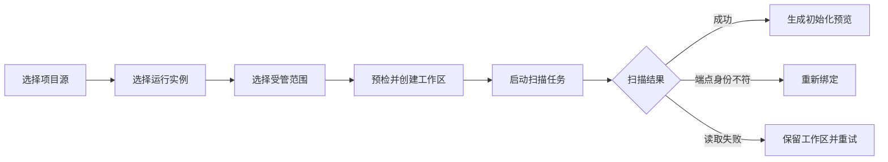
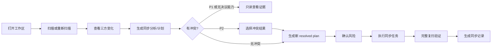

# PackGradle 工作区 UX 交互原型设计

> 状态：UX 原型设计基线  
> 日期：2026-08-22  
> 架构依据：[`packgradle-architecture-redesign.md`](../architecture/packgradle-architecture-redesign.md)  
> 实施依据：[`packgradle-implementation-roadmap.md`](../architecture/packgradle-implementation-roadmap.md)  
> 适用终端：Wails 桌面端，设计窗口 `1200 x 780`，最小窗口 `940 x 620`  
> 用途：供 Figma、MasterGo、Axure 等工具制作中高保真交互原型，不作为前后端字段契约的替代品。

## 0. 文档使用方式

本原型以架构中的 `Relation` 为核心，但用户界面统一称为“工作区”。设计时先制作 Phase 1 的只读闭环，再按能力开关增加 Phase 2 和 Phase 3 画板，不在 Phase 1 页面上摆放永久禁用的未来按钮。

阶段标记：

| 标记 | 原型中可表达的能力 |
| --- | --- |
| `P1` | 登记端点、创建工作区、扫描、查看差异、查看初始化预览或同步分析。 |
| `P2` | 显式冲突选择、风险确认、copy-based 执行、验证、SyncCommit 历史。 |
| `P3` | RestorePlan、恢复能力判断、exact/partial 恢复和恢复任务。 |
| `P4` | 自动合并适配器、hardlink/Junction、更多 Runtime adapter。 |

原型制作约定：

1. 先画 `1200 x 780` 主画板，再验证 `1440 x 900` 和 `940 x 620`。
2. 所有页面使用同一桌面壳层、状态语义和任务中心。
3. 文档中标记“依赖契约”的内容只画交互意图，不假设后端字段已经存在。
4. 所有示例名称和数据均为原型数据，不表示真实项目状态。

## 1. 产品任务与设计目标

### 1.1 核心产品任务

用户需要在一个 Packwiz Project 与一个 Minecraft Runtime 之间完成以下判断：

1. 当前关联的是否仍是原来的两个端点；
2. 两侧分别发生了什么变化；
3. 系统计划向哪一侧创建、修改或删除哪些资源；
4. 哪些变化存在冲突、不可恢复或 Git 工作树风险；
5. 执行是否完成验证并形成可追溯记录；
6. 失败时如何恢复，而不是把“部分写入”误报为成功。

### 1.2 完成标准

| 用户任务 | 完成标志 |
| --- | --- |
| 创建工作区 | Relation 创建成功，两侧扫描完成，初始化预览可查看。 |
| 日常检查 | 用户能区分 Project、Baseline、Runtime 三方状态，并判断下一步。 |
| 执行同步 | 已确认计划完成 Apply 和完整复扫，生成 exact 或用户主动 skip 后的 partial Commit。 |
| 处理冲突 | 冲突选择被固化为新的 resolved plan，旧计划保持不可变。 |
| 处理端点移动 | 新端点通过重绑定预检；无法证明等价时进入“需要初始化”。 |
| 恢复历史状态 | 当前状态与目标历史生成新的 RestorePlan，成功后产生新的 Commit。 |
| 处理执行中断 | 工作区离开 `recovery_required`，或保留清楚的人工处理结论。 |

### 1.3 不可破坏的 UX 原则

1. **工作区是唯一跨端操作入口。** 项目源与运行实例页面只管理端点。
2. **计划先于写入。** 不提供绕过 Plan 的“直接推送”“直接拉取”或文件级写按钮。
3. **事件不是事实。** 事件只触发刷新或进度提示，页面状态通过查询恢复。
4. **正交状态分开显示。** 关系健康、扫描、基线和差异状态不能压成一个“正常/异常”。
5. **计划不可变。** 冲突选择生成新计划，不修改原计划；新扫描后不迁移旧草稿。
6. **阶段能力不占位。** Feature 未实现时不注册入口，不画长期 disabled 按钮。
7. **失败不伪装 partial。** 执行或验证失败进入 `recovery_required`；partial 只表示用户预先跳过部分资源。
8. **实现信息按需出现。** ID、digest、fingerprint、原始 detail 只进入诊断区域。

## 2. 用户角色

| 角色 | 主要目标 | 首要判断 |
| --- | --- | --- |
| 整合包维护者 | 将 Project 声明同步到测试 Runtime | 哪些文件会写入 Runtime，是否存在覆盖或删除。 |
| 本地测试者 | 将 Runtime 中验证有效的调整写回 Project | 哪些内容会进入 Git 工作树，是否应该跳过本机特有文件。 |
| 多实例维护者 | 一个 Project 维护多个 Runtime | 每条工作区是否拥有独立策略、基线、任务与历史。 |
| 故障处理者 | 处理端点移动、计划过期和执行中断 | 当前证据是否足够继续，是否需要重扫、重绑或恢复。 |
| 审计用户 | 查看一次同步改变了什么 | Commit 是 exact 还是 partial，剩余差异和恢复能力是什么。 |

## 3. 用户语言

### 3.1 推荐术语

| 架构术语 | 用户界面文案 | 使用规则 |
| --- | --- | --- |
| Relation / Workspace | 工作区 | 跨端关系的唯一产品名称。 |
| Project | 项目源 | 首次出现可写“Packwiz 项目源”。 |
| Runtime | 运行实例 | 首次出现可写“Minecraft 运行实例”。 |
| MappingPolicy | 受管范围 | 详情中可补充“策略版本”。 |
| Scan | 扫描 | 只读，不暗示同步。 |
| ObservedSnapshot | 扫描结果 | `snapshot_id` 只在诊断中出现。 |
| SyncBaseline | 同步基线 | 主要用于状态说明和历史详情。 |
| Diff / Changes | 变化 | 页面标题使用“变化”。 |
| SyncPlan in Phase 1 | 同步分析 / 初始化预览 | 不使用“可执行”“完成同步”。 |
| SyncPlan in Phase 2 | 同步计划 | 只有 `sync_apply=true` 时使用执行语义。 |
| Apply | 执行同步 | 只能从 resolved plan 进入。 |
| SyncCommit | 同步记录 | 列表中附 exact/partial 状态。 |
| RestorePlan | 恢复计划 | 不使用“直接回滚”。 |
| Rebind | 重新绑定 | 明确是哪一侧端点。 |
| stale plan | 分析已过期 / 计划已过期 | 保留只读内容，禁止继续执行。 |
| recovery_required | 需要恢复 | 不翻译为“部分完成”。 |

### 3.2 状态文案

| 状态组 | 枚举 | 建议文案 |
| --- | --- | --- |
| Scan | `never_scanned` | 未扫描 |
| Scan | `queued` | 等待扫描 |
| Scan | `scanning` | 扫描中 |
| Scan | `ready` | 扫描完成 |
| Scan | `failed` | 扫描失败 |
| Baseline | `none` | 未建立同步基线 |
| Baseline | `ready` | 同步基线有效 |
| Baseline | `stale` | 同步基线待更新 |
| Diff | `unknown` | 变化未知 |
| Diff | `initialization_required` | 需要初始化 |
| Diff | `clean` | 无待同步变化 |
| Diff | `dirty` | 有待同步变化 |
| Diff | `conflicted` | 存在冲突 |
| Health | `healthy` | 工作区正常 |
| Health | `endpoint_missing` | 端点不可用 |
| Health | `rebind_required` | 需要重新绑定 |
| Health | `recovery_required` | 需要恢复 |

状态标签是只读状态，不使用按钮外观和 `cursor: pointer`。

## 4. 信息架构

### 4.1 一级导航

```text
工作区        /workspaces
项目源        /sources
运行实例      /runtimes
设置          /settings
```

默认首页为“工作区”。旧版“项目管理”“Prism 联动”“开发版本”等跨端入口不进入新导航。

### 4.2 工作区内导航

```text
工作区标题
  ├─ 变化       /workspaces/:id/changes
  ├─ 受管范围   /workspaces/:id/mappings
  └─ 历史       /workspaces/:id/history        [history_view]

上下文页面
  ├─ 计划       /workspaces/:id/plans/:plan_id
  ├─ 重新绑定   /workspaces/:id/rebind
  └─ 记录详情   /workspaces/:id/history/:commit_id
```

“计划”“重新绑定”“记录详情”不作为常驻页签，通过当前对象进入，并保留返回位置。

建议新增恢复详情页面：

```text
/workspaces/:id/recoveries/:recovery_id
```

该路由尚未在架构信息架构中固定。原型可制作完整页面，但实施前必须补充正式路由与 DTO 决策。

### 4.3 阶段能力门控

| 阶段 | 显示 | 隐藏 |
| --- | --- | --- |
| Phase 1 | 工作区、端点、扫描、变化、受管范围、初始化预览、同步分析。 | Apply、冲突决议控件、History、Restore、hardlink、Junction、自动合并。 |
| Phase 2 | 冲突选择、copy Apply、验证结果、任务、SyncCommit 历史。 | Restore、hardlink、Junction、自动合并。 |
| Phase 3 | 恢复计划、恢复能力、exact/partial 恢复、恢复任务。 | 无法证明的 exact restore。 |
| Phase 4 | 能力返回的合并适配器、hardlink/Junction、更多 Runtime adapter。 | Feature 未返回的模式。 |

Feature 决定页面和动作是否存在；ActionAvailability 决定已存在动作当前能否执行。当前不可执行时显示后端给出的原因，但不能隐藏历史、冲突证据和恢复诊断。

主操作的 Feature 已实现但当前不可用时，保留其稳定位置并在按钮旁显示具体原因；低频菜单项当前不可用时直接隐藏，避免留下无法解释的灰色图标。

## 5. 桌面壳层

### 5.1 页面结构

```text
┌────────────────────────────────────────────────────────────────────┐
│ 标题栏：页面/工作区标题                       任务中心  主题  窗口 │
├────────┬───────────────────────────────────────────────────────────┤
│ 68px   │ 工作区对象头或页面头                                      │
│ 图标栏 │ 页签 / 工具栏                                             │
│        │───────────────────────────────────────────────────────────│
│        │ 主内容区：唯一页面纵向滚动容器                            │
│        │                                                           │
└────────┴───────────────────────────────────────────────────────────┘
```

区域规则：

- 左侧 icon rail 沿用现有 68px 规格，入口使用 MDI 图标和 tooltip。
- 顶栏中间保留 Wails 拖拽区，页面动作不进入拖拽区。
- 顶栏右侧固定任务中心；不再使用一次性 snackbar 承担长任务结果。
- 页面内容使用全宽工作区和轻量分隔，不把每个区块包成浮动卡片。
- 页面只允许主内容区纵向滚动；表格可在自身容器横向滚动。

### 5.2 工作区对象头

首屏固定表达：

1. `Project 名称 ↔ Runtime 名称`；
2. Project 与 Runtime 的适配器；
3. 关系健康和差异状态；
4. 最近一次有效扫描时间；
5. 当前状态下唯一主操作；
6. “更多”菜单中的重新绑定、打开端点位置和复制诊断信息。

路径使用省略显示，hover 显示完整路径，点击复制；`relation_id` 与 revision 进入诊断抽屉。

### 5.3 任务中心

右侧抽屉建议宽度 `min(400px, viewport - rail)`，不覆盖为模态页面。

任务项包含：

- 工作区名称；
- 任务类型：扫描、执行同步、恢复、GC；
- 状态：排队、处理中、成功、失败、已取消、需要恢复；
- 当前阶段与确定/不确定进度；
- exact/partial outcome；
- 更新时间；
- `取消任务`，只在 `can_cancel=true` 时显示；
- `查看工作区`、`查看计划`、`处理恢复`等上下文动作。

事件流跳号、窗口重开或应用启动时，抽屉显示短状态“正在恢复任务状态”，随后以 `ListTasks/GetTask` 查询结果为准。原型中的“标记为已读”只清除前端未读状态，不画成删除后端任务历史。

## 6. 核心流程

### 6.1 创建与初始化



流程规则：

- 创建工作区不修改 Project 或 Runtime 文件。
- 创建成功后立即启动扫描；扫描作为后台 Task，可离开当前页面。
- 用户仍停留在创建流程时，扫描成功后自动生成初始化预览并进入计划页。
- 用户已经离开时，任务结果提供“查看初始化预览”，工作区列表同步显示下一步。
- 两侧没有 Baseline 时，不根据 mtime、文件数量或路径猜测方向。

### 6.2 日常扫描与同步



### 6.3 计划过期

1. Watcher 只把当前工作区标记为可能过期并触发受控重查。
2. 后端确认 Plan stale 或 expired 后，计划内容继续可读。
3. 冲突控件、风险确认和 Apply 全部停止。
4. 主操作改为“重新扫描并生成新计划”。
5. 旧 `plan_id` 的草稿不得自动迁移到新计划。

### 6.4 重新绑定


### 6.5 历史恢复

Restore 不是直接反转数据库记录：


### 6.6 执行中断与恢复

执行或验证失败时：

- 不显示“部分完成”；
- 工作区进入“需要恢复”，阻止新的 Apply/Restore；
- 保留历史、冲突证据和恢复诊断；
- 提供后端声明可用的 `继续恢复`、`补偿已执行操作`或`确认人工处理`；
- 恢复页面展示 journal 阶段和资源结果，但普通用户视图不暴露临时绝对路径。

## 7. 页面原型规格

### 7.1 工作区列表 `/workspaces`

**用户任务**：比较全部工作区，找到需要扫描、处理变化、重绑或恢复的对象。

**主操作**：`新建工作区`

```text
┌ 工作区 ──────────────────────────────────────────── 新建工作区 ┐
│ [搜索工作区] [全部状态 v] [仅看活动任务]                        │
├─────────────────────────────────────────────────────────────────┤
│ 工作区            关系健康       变化状态       当前任务  最近活动 │
│ Collapse           正常           有冲突         -         14:20   │
│ ↔ Collapse Dev                                                    │
│ Collapse           正常           无变化         扫描中 62% 14:18  │
│ ↔ Playtest                                                        │
│ Legacy Pack        需要重新绑定   变化未知       -         昨天    │
│ ↔ Old Instance                                                    │
└─────────────────────────────────────────────────────────────────┘
```

建议列：

| 列 | 内容 |
| --- | --- |
| 工作区 | Project 与 Runtime 名称、适配器；路径只作次级信息。 |
| 关系健康 | healthy、endpoint missing、rebind required、recovery required。 |
| 变化状态 | 未扫描、需要初始化、无变化、有变化、有冲突。 |
| 当前任务 | 任务类型、阶段、进度；没有任务时显示短横线。 |
| 最近活动 | 最近扫描或 Commit 的用户本地时间。 |
| 行操作 | 当前状态下的主上下文动作和“更多”。 |

行操作优先级：

1. `需要恢复` -> `处理恢复`；
2. `需要重新绑定` -> `重新绑定`；
3. `未扫描/扫描失败` -> `开始扫描/重试扫描`；
4. `扫描中` -> `查看任务`；
5. `需要初始化/有变化/有冲突` -> `查看变化`；
6. `无变化` -> 点击行进入工作区。

状态画板：

- loading：保留标题、工具栏和表头，显示 5 行同构骨架；
- empty：`还没有工作区` + 唯一动作 `新建工作区`；
- filtered-empty：保留筛选器，显示 `清除筛选`；
- error：保留旧列表并就近显示失败；首次失败显示 `重新加载`；
- active task：只更新对应行，不遮罩全页；
- recovery required：使用稳定错误图标和状态色，不使用整行鲜红背景。

### 7.2 新建工作区 `/workspaces/new`

**承载方式**：完整页面。左侧步骤导航，右侧单步骤内容。

步骤：

1. `选择项目源`
2. `选择运行实例`
3. `选择受管范围`
4. `确认并创建`

#### 步骤 1：选择项目源

- 搜索覆盖完整候选集合或使用服务端搜索。
- 候选显示名称、根路径、Packwiz 解析健康、关联工作区数量。
- 当前选择即时生效，不增加单独“保存”。
- 次级动作 `登记项目源` 打开共享中型弹窗；成功后自动选中新端点并返回当前步骤。

#### 步骤 2：选择运行实例

- 候选显示实例名称、启动器、根路径、健康状态。
- 已与当前 Project 建立 Relation 的 Runtime 标记“已建立工作区”，不可重复选择，并显示原因。
- 次级动作 `登记运行实例` 的行为与项目源一致。

#### 步骤 3：选择受管范围

- 显示后端提供的 MappingPolicy 候选，不在原型中虚构模板名称。
- 每个候选展示资源类型、方向摘要、默认物化方式。
- `config`、`kubejs`、`scripts`、`defaultconfigs`只能作为后端返回的建议范围，不默认勾选。
- P1/P2 默认物化方式为 `复制`。

#### 步骤 4：确认并创建

首屏摘要：

- `Collapse Pack ↔ Collapse Dev`
- 两侧完整路径；
- 适配器身份；
- 受管范围与方向；
- 物化方式；
- 固定说明：`创建后将立即扫描两侧端点，不会修改项目源或运行实例文件。`

主操作 `创建工作区` 先执行 `PrepareRelation`，展示重复 pair、路径包含、绑定证据和 legacy materialization 等预检结果，再以 preparation ID 执行 `CreateRelation`。

创建后页面切换为进度态：

```text
[完成] 创建工作区
[进行] 扫描项目源与运行实例
[等待] 生成初始化预览
```

允许返回工作区列表，任务继续由任务中心追踪。

### 7.3 工作区变化 `/workspaces/:id/changes`

**用户任务**：理解三方状态和诊断，生成覆盖全部受管范围的分析或计划。

**主操作**：

- P1：`生成同步分析`或`生成初始化预览`；
- P2：`生成同步计划`；
- 未扫描：`开始扫描`；
- stale：`重新扫描`；
- recovery required：`处理恢复`。

```text
┌ Collapse Pack ↔ Collapse Dev ───────────── 正常 / 有冲突 ───────┐
│ 变化 | 受管范围 | 历史                            重新扫描  生成计划 │
├─────────────────────────────────────────────────────────────────┤
│ [优先状态横幅：需要恢复 / 重新绑定 / 扫描中 / 过期 / 有冲突]     │
│ Project 扫描 14:20 | Runtime 扫描 14:20 | 基线有效 | 资源 2,986  │
│ [全部] [有变化] [有冲突] [Project 已改] [Runtime 已改] [含删除]  │
│ [搜索资源] [资源类型 v]                                         │
├─────────────────────────────────────────────────────────────────┤
│ 资源              Project        Baseline       Runtime   判断   │
│ Create             0.5.1 已修改   0.5.0          0.5.0     P→R   │
│ jei-client.ini     已修改         旧版本         已修改     冲突   │
└─────────────────────────────────────────────────────────────────┘
```

状态横幅优先级：

`recovery_required > rebind_required > endpoint_missing > scan failed > queued/scanning > stale > initialization_required > conflicted > dirty > clean`

横幅只表达当前最需要处理的状态；其他正交状态保留在指标区。

资源表：

| 列 | 内容 |
| --- | --- |
| 资源 | 用户可识别名称、相对路径或 provider；资源类型为次级信息。 |
| Project | 存在、增加、修改、删除、不可读；mod 显示语义版本。 |
| Baseline | 上次认可状态；无 Baseline 时显示“未建立”。 |
| Runtime | 与 Project 列相同的状态语义。 |
| 判断 | 一致、Project 已改、Runtime 已改、双端冲突、删除冲突、低置信身份。 |
| 行末 | `查看证据`，打开资源详情抽屉。 |

筛选只改变展示，不改变计划范围。工具栏固定提示：

`计划会分析当前策略下的全部受管资源，不受表格筛选影响。`

资源详情抽屉：

- Header：资源名称、类型、判断、关闭；
- Body：Project、Baseline、Runtime 三栏证据；窄窗改为纵向；
- 显示相对路径、格式、版本/大小、变化原因、命中的 MappingRule；
- hash、resource ID、snapshot ID、诊断 detail 放入“技术信息”；
- `runtime_local` 与 `directory_manifest`只进入诊断，不出现同步决议控件。

Watcher invalidation：

- 保留旧表格；
- 顶部显示 `检测到端点可能发生变化，当前结果已标记为过期。`；
- `重新扫描`成为主操作；
- 事件 payload 不直接替换资源表。

### 7.4 受管范围 `/workspaces/:id/mappings`

**默认状态**：只读策略表。

建议列：

`资源类别 / Project 范围 / Runtime 范围 / 方向 / Include/Exclude 摘要 / 物化方式 / 状态`

页面区块：

1. 当前策略名称、revision、适用资源数；
2. 已生效规则表；
3. “建议纳管”区，显示后端返回但尚未生效的模板；
4. mapping collision 与未知格式诊断。

编辑行为依赖后端 Mapping API：

- 若没有编辑 Feature，只显示只读策略和诊断，不显示 disabled“编辑”按钮；
- 若有编辑 Feature，点击 `编辑受管范围` 进入页面级编辑模式；
- 多条规则采用统一提交，不逐行保存；
- 保存前确认：`保存后工作区版本将更新，现有 N 个同步计划会立即过期。不会立即修改两侧文件。`；
- `mapping_collision` 是阻断性行内错误，不能通过规则顺序隐式覆盖。

P4 的 hardlink/Junction 只在 `materialization_modes` 返回时出现，并显示“共享而非复制”及其对独立差异、冲突和恢复能力的影响。

### 7.5 计划 `/workspaces/:id/plans/:plan_id`

同一路由承载 `initialize`、`sync`、`restore` 三类不可变计划。

标题：

- `初始化预览`；
- `同步分析`（P1）；
- `同步计划`（P2）；
- `恢复计划`（P3）。

```text
┌ 同步计划 ─────────────── resolved / 有效 ───────────────────────┐
│ Collapse Pack → Collapse Dev              返回变化页             │
├─────────────────────────────────────────────────────────────────┤
│ 资源 86 | 创建 12 | 修改 61 | 删除 13 | 冲突 0 | 不可恢复 2      │
│ [操作] [冲突] [风险与前置条件]                                  │
├─────────────────────────────────────────────────────────────────┤
│ 资源              方向    操作    目标表示       可恢复性    风险 │
│ config/jei...      P → R   覆盖    text/toml      CAS         覆盖 │
│ mod:create         P → R   写入    mod 0.5.1      可重新下载   -   │
├─────────────────────────────────────────────────────────────────┤
│ 风险确认摘要                                      确认并执行同步 │
└─────────────────────────────────────────────────────────────────┘
```

顶部摘要必须显示：

- Project 与 Runtime；
- 源侧和目标侧；
- 资源、创建、修改、删除数量；
- 写入 Project 与写入 Runtime 数量；
- 冲突和不可恢复数量；
- 物化后果；
- 计划状态和有效期。

若计划同时包含两个方向的操作，方向摘要显示“双方均有写入”，并分别列出写入 Project 和写入 Runtime 的数量，不用单一箭头把双向计划误画成单向。

正文页签：

1. `操作`：只读操作表；
2. `冲突`：P1 只读证据，P2 可建立当前 plan 的决议草稿；
3. `风险与前置条件`：确认要求、端点证据、snapshot/revision 摘要。

#### Draft plan 冲突决议 `[P2]`

每项选择：

- `以项目源为准` (`take_project`)；
- `以运行实例为准` (`take_runtime`)；
- `本次跳过` (`skip`)；
- `手动处理` (`manual`)。

决议规则：

- 选择草稿严格按 `plan_id` 保存；
- `以运行实例为准`显示“会写入 Project，并影响 Git 工作树”；
- `本次跳过`显示“本次记录将为 partial，工作区仍保留差异”；
- `手动处理`只提供两侧证据和打开位置动作，外部修改后必须重新扫描；
- 批量选择只作用于当前可见且同类型冲突，并显示明确资源数；
- 筛选变化前清除隐藏选择，或明确询问保留范围；
- 主操作 `生成已决议计划` 调用 ResolvePlan，成功后导航到新的 `plan_id`。

新计划显示来源：`由上一份分析的冲突选择生成`。内部 plan ID 进入可复制的技术信息，不作为主标题。

#### Resolved plan 风险确认与 Apply `[P2]`

确认 requirements 由后端计划计算：

- 覆盖；
- 删除；
- 写入 Project；
- 不可恢复；
- 共享物化。

推荐使用计划页底部的固定确认区，而不是再叠加一层重复确认弹窗：

1. 动态列出必须确认的具体后果；
2. 用户逐项勾选 acknowledgement；
3. 单一主操作 `确认并执行同步`；
4. 前端调用 ConfirmPlan 获取一次性 token，立即调用 ApplySync；
5. token 不显示、不保存为长期 UI 状态；
6. Apply 接受后跳回工作区或任务详情，工作区显示 queued/running。

若项目最终保留确认弹窗，则计划页不再重复放第二套勾选项，必须保证同一决定只确认一次。

#### Stale / expired

- 计划内容继续可读；
- 冲突选择、风险确认和执行控件全部隐藏；
- 顶部说明具体过期原因；
- 主操作 `重新扫描并生成新计划`；
- 次级操作 `返回工作区`；
- 不迁移旧 plan 草稿。

#### P1 计划页

Phase 1 只显示影响摘要、操作、冲突证据、风险和前置条件。页面没有完成型主按钮，可提供 `返回变化页`和`重新扫描`。

### 7.6 重新绑定 `/workspaces/:id/rebind`

**承载方式**：完整页面，避免把绑定证据和影响说明塞进确认弹窗。

布局：

| 左栏：当前登记 | 右栏：候选端点 |
| --- | --- |
| 端点名称、适配器、路径、最后成功扫描、fingerprint 摘要 | 选择器、名称、适配器、路径、fingerprint 摘要、健康检查 |

下方预检区：

- 是否重复 Project/Runtime pair；
- 路径是否互相包含；
- 是否检测到 legacy materialization；
- 哪些 Plan 会失效；
- Baseline 能否证明可继承；
- 无法证明等价时是否进入“需要初始化”。

主操作 `确认重新绑定` 只在 preparation 有效时出现。执行中锁定本页提交区，成功后进入工作区变化页；失败保留候选端点和预检证据。

### 7.7 历史 `/workspaces/:id/history` `[P2]`

**用户任务**：比较 SyncCommit，找到需要审计或恢复的记录。

使用紧凑时间线表格：

`时间 / 类型 / 完整性 / 创建-修改-删除 / 剩余差异 / 来源计划`

显示规则：

- exact：`完整完成`；
- partial：`部分完成，仍有 N 项差异`；
- 失败执行不进入历史列表，而进入 Task/Recovery；
- History 可在 Phase 2 开放，即使 Restore 尚未实现；
- Runtime 离线时仍可浏览历史和诊断。

### 7.8 同步记录详情 `/workspaces/:id/history/:commit_id`

首屏：

- Commit 类型：初始化、同步、恢复；
- exact/partial；
- 创建、修改、删除数量；
- 剩余差异；
- 验证后的 Project/Runtime 扫描时间；
- 原计划入口。

变化表：

`资源 / Project 前后 / Runtime 前后 / 操作 / 恢复能力`

恢复能力：

- `可从本地对象恢复`；
- `需要重新下载`；
- `需要提供本地文件`；
- `无法恢复`。

P2 页面没有恢复按钮。P3 且 `restore_preview=true` 时显示主操作 `准备恢复计划`；ActionAvailability 不允许时显示具体原因。

### 7.9 项目源 `/sources`

**职责**：Packwiz Project 的登记、识别、解析健康和源码位置维护。

建议表格列：

`项目源 / 根路径 / 适配器 / 解析健康 / 关联工作区 / 最近检查 / 更多`

主操作 `登记项目源`。行点击打开只读详情抽屉，显示解析诊断和关联工作区。跨端扫描、推送、拉取、同步不出现在此页。

移除端点前说明：

- 是否仍有工作区引用；
- 只移除 PackGradle 登记，不删除磁盘文件；
- 有引用时由后端决定阻止或进入迁移流程，前端不能自行级联删除。

### 7.10 运行实例 `/runtimes`

**职责**：Runtime 发现、登记、创建和健康检查。

建议表格列：

`运行实例 / 启动器 / 根路径 / 绑定健康 / 关联工作区 / 最近检查 / 更多`

主操作按后端能力显示 `登记运行实例`或`创建运行实例`。行详情包含 adapter identity 和诊断，但不提供跨端写入动作。

### 7.11 设置 `/settings`

设置采用全宽分区，不使用嵌套卡片：

1. 适配器与工具：Packwiz、Prism 和后续 adapter 健康；
2. 凭据：只显示已配置状态和 credential reference，不回显完整 secret；
3. 本地存储：SQLite、CAS、staging、日志位置与健康；
4. 保留策略：只有 ADR 和后端能力确定后才显示可编辑控件；
5. 诊断：导出脱敏诊断包、查看日志目录、复制版本信息。

每个独立数据对象使用自己的提交边界。生产构建不显示 mock 写操作切换。

### 7.12 恢复详情 `[P2/P3，路由待定]`

恢复处理复杂度超过弹窗，应使用完整页面。

页面包含：

- 工作区和触发任务；
- journal 阶段：prepared、staged、applying、verifying、recovery required；
- 已验证、已应用、待确认、失败的操作数量；
- 后端给出的实际路径探测结论和所有权证据摘要；
- 可用动作：`继续恢复`、`补偿已执行操作`、`确认人工处理`；
- 诊断信息复制区。

只显示后端声明可用的恢复动作。执行恢复时页面保留对象与状态，不提前关闭或导航。

## 8. 共享组件原型

| 组件 | 作用 | 必备状态 |
| --- | --- | --- |
| `WorkspaceIdentity` | Project ↔ Runtime 的稳定识别 | normal、long-name、endpoint-missing |
| `WorkspaceStateSummary` | 四组正交状态 | compact、full、stale |
| `EndpointIdentity` | 端点名称、适配器、路径、健康 | selected、candidate、invalid |
| `TaskStatus` | Task 的状态和阶段 | queued、running、success、failed、cancelled、recovery |
| `ResourceTriStateTable` | Project/Baseline/Runtime 三态比较 | loading、ready、filtered-empty、stale |
| `ResourceEvidenceDrawer` | 单资源证据与诊断 | normal、conflict、low-confidence、unreadable |
| `PlanSummary` | 不可变影响摘要 | draft、resolved、stale、expired、applied |
| `ConflictDecisionGroup` | 当前 plan 的冲突草稿 | unset、selected、invalid、read-only |
| `RiskAcknowledgement` | 后端 requirements 的一次确认 | incomplete、ready、submitting、error |
| `AvailabilityReason` | 动作不可用原因 | inline、banner、tooltip-short |
| `ProblemDetails` | 结构化错误与可复制 detail | user-message、expanded-detail |
| `RecoverySummary` | recovery journal 与可用动作 | probing、actionable、manual-required |

组件规则：

- 同一区域最多一个高强调主操作；
- 状态不画成按钮；
- 低频管理动作进入“更多”；
- 行操作位置保持稳定，hover 时出现也不能推动内容；
- 对话框使用固定 Header、唯一滚动 Body、固定 Footer；
- 长任务不使用持续旋转 spinner。

## 9. 状态矩阵

| 范围 | Loading | Empty | Error | Processing | Ready |
| --- | --- | --- | --- | --- | --- |
| 应用启动 | 品牌位置稳定的启动骨架 | 不适用 | 恢复入口 | 正在查询 Task/Workspace | 应用壳层 |
| 工作区列表 | 表头 + 同构行骨架 | 新建工作区 | 就近重试 | 单行任务状态 | 表格 |
| 变化页 | 保留对象头和工具栏，表格骨架 | clean 或无受管资源 | 保留旧结果并提示 | 扫描任务状态 | 三方资源表 |
| 计划页 | 固定摘要骨架 | 不适用 | 返回变化页/重新生成 | Resolve/Confirm 局部提交 | 不可变计划 |
| 弹窗 | 保持尺寸的局部骨架 | 局部原因 | 弹窗内重试 | Footer 主按钮 loading | 表单或确认内容 |
| 长任务 | 不使用 spinner | 不适用 | 原因 + 恢复动作 | queued/running + phase | exact/partial 结果 |

特殊状态：

| 状态 | 行为 |
| --- | --- |
| refreshing | 保留旧的已提交查询快照，触发控件显示刷新中。 |
| filtered-empty | 保留搜索与筛选，提供清除动作。 |
| stale | 保留证据，禁止基于旧状态继续 Apply。 |
| recovery_required | 阻止该 Relation 的新 Apply/Restore，保留历史和诊断。 |
| partial | 显示已完成范围与剩余差异，Relation 继续 dirty/conflicted。 |
| clean | 只有扫描完成、Baseline 有效且 Diff 明确无变化时出现。 |

## 10. 错误与恢复文案

后端错误以 `err.*` code 和 args 映射用户文案，`detail` 只放在可展开、可复制的诊断区。

| 错误域 | 默认落点 | 恢复动作 |
| --- | --- | --- |
| `err.relation.*` | 工作区对象头或创建/重绑预检 | 返回选择、重新绑定、重新加载工作区 |
| `err.scan.*` | 变化页状态横幅与任务中心 | 重试扫描、查看端点诊断 |
| `err.resource.*` | 资源行和证据抽屉 | 查看证据、外部处理后重扫 |
| `err.diff.*` | 变化页或 Mapping 诊断 | 修正规则、重新扫描 |
| `err.sync.plan_stale` | 计划页固定过期状态 | 重新扫描并生成新计划 |
| `err.sync.*` | 计划确认区或执行任务 | 保留计划、按错误类型重试 |
| `err.history.*` | 历史页或记录详情 | 重试、返回历史 |
| `err.object.*` | 恢复能力与诊断 | 提供本地对象、选择 partial、停止 exact |
| `err.recovery.*` | 恢复详情页 | Resume、Compensate、人工确认 |

禁止把错误显示成 empty，也不在请求失败后清空用户的冲突选择、表单输入或当前对象。

## 11. 视觉与交互规范

### 11.1 视觉方向

- 延续现有 PCL2 风格的紧凑桌面工具气质。
- 使用深色/浅色双主题；主色可沿用青色，状态色保持绿色、琥珀色、红色和中性灰的稳定语义。
- 不使用渐变、装饰性光斑、营销式 Hero、大圆角或卡片套卡片。
- 卡片圆角不超过 8px，只用于独立重复对象、模态和真正需要框定的工具。
- 页面层级依靠标题、对齐、分隔线和背景层级，不为每个状态增加彩色强调边。

### 11.2 密度建议

| 元素 | 参考规格 |
| --- | --- |
| 标题栏 | 44-48px |
| icon rail | 68px |
| 页面工具栏 | 44-52px，可在窄窗换行 |
| 表格行 | 48-56px，冲突证据可展开但默认不增高 |
| 图标按钮 | 稳定 36-40px 点击区 |
| 页面边距 | 20-24px；最小窗口可降至 16px |
| 抽屉 | 400px 上限，窄窗适配剩余宽度 |

固定尺寸用于保护点击区和布局稳定，不为单张截图写死内容高度。

### 11.3 窗口适配

| 视口 | 规则 |
| --- | --- |
| `1440 x 900` | 展示完整表格列，可并列资源证据或重绑定双栏。 |
| `1200 x 780` | 默认设计基准；辅助详情使用抽屉。 |
| `940 x 620` | 隐藏低价值列；双栏改纵向；工具栏换行；页签横向滚动。 |

通用规则：

- 页面不得整体横向滚动；
- 表格只在自身容器横向滚动，并固定资源身份列；
- 长 Project/Runtime 名称最多两行，路径单行省略并可复制；
- 主操作在布局变化后仍位于首屏和稳定区域；
- 不设计移动端底部导航，这是一款可缩放桌面工具。

## 12. 原型示例数据

示例数据必须在原型文件中标记为“演示数据”。

### 12.1 工作区

| 工作区 | 健康 | Scan | Baseline | Diff | 用途 |
| --- | --- | --- | --- | --- | --- |
| Collapse Pack ↔ Collapse Dev | healthy | ready | ready | conflicted | 主要差异与冲突画板 |
| Collapse Pack ↔ Playtest | healthy | scanning | ready | unknown | Task 和 refreshing 画板 |
| Legacy Pack ↔ Old Instance | rebind_required | failed | stale | unknown | 重绑定画板 |
| Recovery Demo ↔ QA Runtime | recovery_required | ready | ready | dirty | 恢复画板 |

### 12.2 资源

| 资源 | Project | Baseline | Runtime | 判断 |
| --- | --- | --- | --- | --- |
| `mod:create` | 0.5.1 | 0.5.0 | 0.5.0 | Project 已改 |
| `config/jei/jei-client.ini` | 已修改 A | 旧版本 | 已修改 B | 双端冲突 |
| `scripts/server.js` | 已删除 | 旧版本 | 已修改 | 删除/修改冲突 |
| `mod:local-addon` | 本地低置信表示 | 无 | JAR | 身份需人工确认 |
| `runtime_local:options.txt` | 不适用 | 不适用 | 存在 | 诊断，不是可同步资源 |

### 12.3 计划风险

- 覆盖 8 个文件；
- 删除 2 个资源；
- 写入 Project 3 项；
- 1 个 mod 只能重新下载；
- 1 个本地 JAR 无法保证恢复；
- 2 个冲突选择为 skip，用于展示 partial Commit。

## 13. 原型画板清单

### 13.1 必做画板

| ID | 页面/状态 | 阶段 | 关键交互 |
| --- | --- | --- | --- |
| `S-01` | 应用壳层 + 任务中心关闭 | P1 | 一级导航、标题栏、工作区标题 |
| `S-02` | 任务中心打开 | P1 | queued/running/failed/recovery 项 |
| `W-01` | 工作区列表 loading | P1 | 同构骨架 |
| `W-02` | 工作区列表 empty | P1 | 新建工作区 |
| `W-03` | 工作区列表 ready | P1 | 正交状态、行进入详情 |
| `W-04` | 工作区列表含 active/recovery | P2 | 查看任务、处理恢复 |
| `N-01` | 新建工作区：选择项目源 | P1 | 搜索、选择、登记新端点 |
| `N-02` | 新建工作区：选择运行实例 | P1 | 重复 pair 不可选原因 |
| `N-03` | 新建工作区：选择受管范围 | P1 | Policy 摘要 |
| `N-04` | 新建工作区：预检与创建 | P1 | Preparation 结果、创建提交 |
| `N-05` | 新建工作区：扫描进度 | P1 | 离开页面、任务中心追踪 |
| `C-01` | 变化页 never scanned | P1 | 开始扫描 |
| `C-02` | 变化页 scanning | P1 | 旧数据保留、任务阶段 |
| `C-03` | 变化页 dirty | P1 | 三方表、筛选、生成分析 |
| `C-04` | 变化页 conflicted | P1 | 证据抽屉 |
| `C-05` | 变化页 stale | P1 | 重新扫描 |
| `C-06` | 变化页 rebind required | P1 | 进入重绑定 |
| `M-01` | 受管范围只读 | P1 | 已生效规则、建议纳管 |
| `M-02` | mapping collision | P1 | 阻断诊断 |
| `P-01` | 初始化预览 draft | P1 | 只读影响摘要 |
| `P-02` | 同步分析含冲突 | P1 | 只读证据，无 Apply |
| `P-03` | 冲突决议草稿 | P2 | 四种决议、按 plan 隔离 |
| `P-04` | resolved plan + 风险确认 | P2 | acknowledgements、执行 |
| `P-05` | stale plan | P1/P2 | 重新扫描生成新计划 |
| `R-01` | 重绑定候选选择 | P1 | 当前/候选证据对比 |
| `R-02` | 重绑定预检成功 | P1 | Baseline 继承说明 |
| `R-03` | 重绑定进入初始化 | P1 | 明确不继承旧 Baseline |
| `H-01` | 历史列表 | P2 | exact/partial 比较 |
| `H-02` | Commit 详情 | P2 | 变化和恢复能力 |
| `H-03` | RestorePlan | P3 | exact/partial、对象来源 |
| `E-01` | 项目源列表 + 详情抽屉 | P1 | 端点管理，无跨端写入 |
| `E-02` | 运行实例列表 + 详情抽屉 | P1 | 发现、登记、健康 |
| `X-01` | 恢复详情 | P2/P3 | Resume/Compensate/人工确认 |
| `SET-01` | 设置 | P1 | 适配器、凭据、存储、诊断 |

### 13.2 代表性窄窗画板

至少补以下 `940 x 620` 变体：

1. `W-03` 工作区列表；
2. `C-04` 变化页 + 资源证据；
3. `P-04` 计划风险确认；
4. `R-01` 重绑定双栏折叠；
5. `S-02` 任务中心打开。

### 13.3 点击连线建议

| 起点 | 点击 | 终点 |
| --- | --- | --- |
| `W-02/W-03` | 新建工作区 | `N-01` |
| `N-01` | 下一步 | `N-02` |
| `N-02` | 下一步 | `N-03` |
| `N-03` | 下一步 | `N-04` |
| `N-04` | 创建工作区 | `N-05` |
| `N-05` | 查看初始化预览 | `P-01` |
| `W-03` | 点击 conflicted 工作区 | `C-04` |
| `C-04` | 查看证据 | 资源详情抽屉 |
| `C-03/C-04` | 生成同步分析/计划 | `P-02/P-03` |
| `P-03` | 生成已决议计划 | `P-04` |
| `P-04` | 确认并执行同步 | `S-02` 或工作区 running 状态 |
| `C-06` | 重新绑定 | `R-01` |
| `H-01` | 点击 Commit | `H-02` |
| `H-02` | 准备恢复计划 | `H-03` |
| `W-04/S-02` | 处理恢复 | `X-01` |

## 14. 用户动作与应用用例映射

| 用户动作 | 应用用例 | UI 结果 |
| --- | --- | --- |
| 创建工作区预检 | `PrepareRelation` | 展示重复 pair、路径和绑定检查。 |
| 确认创建 | `CreateRelation` | 创建 Workspace 投影，不写两侧文件。 |
| 开始扫描 | `StartScan` | 返回 Task，页面和任务中心追踪。 |
| 生成分析/计划 | `PrepareSync` | 跳转 immutable draft plan。 |
| 提交冲突选择 | `ResolvePlan` | 返回新的 resolved plan，并导航到新 URL。 |
| 确认风险 | `ConfirmPlan` | 获取一次性 token，不作为长期 UI 状态。 |
| 执行同步 | `ApplySync` | 返回 Task；成功后查询 Workspace/Commit。 |
| 查看任务 | `GetTask/ListTasks` | 以 task_sequence 合并权威状态。 |
| 重绑定预检 | `PrepareRebind` | 展示旧/新端点证据和影响。 |
| 确认重绑定 | `ApplyRebind` | 更新 Relation；必要时进入初始化。 |
| 查看历史 | `ListCommits` | 分页 Commit 列表。 |
| 准备恢复 | `PrepareRestore` | 返回 immutable RestorePlan。 |
| 提交恢复选择 | `ResolveRestorePlan` | 返回新的 resolved RestorePlan。 |
| 确认恢复 | `ConfirmRestorePlan` | 获取一次性 token。 |
| 执行恢复 | `ApplyRestore` | 返回 Task，成功后生成新的 Commit。 |
| 处理恢复 | `ResumeRecovery/CompensateRecovery/AcknowledgeRecovery` | 更新 Recovery 和 Workspace 状态。 |

前端不能向 Apply 传入自由拼装的源路径、目标路径、删除清单或临时 resolution。

## 15. 交互验收清单

### 15.1 架构一致性

- [ ] 所有跨端写入都能追溯到 Plan。
- [ ] Project、Runtime 页面没有跨端推送/拉取入口。
- [ ] Plan 内容不可编辑，Resolve 后产生新 plan。
- [ ] 新 Scan 或 Policy revision 后旧草稿不迁移。
- [ ] clean 不由差异数量推断。
- [ ] 事件只触发 stale/刷新，不直接覆盖权威 cache。
- [ ] exact、partial、failed、recovery required 的含义没有混用。
- [ ] Phase 1 没有 Apply、History、Restore 或模拟成功入口。

### 15.2 页面状态

- [ ] loading、empty、filtered-empty、error、refreshing 互斥。
- [ ] 刷新失败时保留旧查询快照。
- [ ] 单项任务只锁定对应对象和操作。
- [ ] 异步确认失败时保留对象、输入和当前位置。
- [ ] stale 计划保留只读证据并停止执行。
- [ ] recovery required 不隐藏历史和诊断。

### 15.3 空间与动作

- [ ] 每页或每个操作区只有一个高强调主操作。
- [ ] 页面只有一个主纵向滚动容器。
- [ ] 表格横向滚动不带动整个页面。
- [ ] 弹窗 Header/Footer 固定，Body 独立滚动。
- [ ] `940 x 620` 下主操作和对象身份仍在首屏。
- [ ] 长名称、路径、错误详情不会遮挡操作。

## 16. 依赖契约与待决策

以下内容应在原型中标注，不得画成已经落地的产品承诺：

1. MappingPolicy 的最终模板、规则优先级编辑方式和服务端/客户端专属默认范围尚未固定。
2. Project/Runtime 完整登记、删除和发现用例未在目标应用接口中完整列出。
3. Resource-level Changes、WorkspaceFeatures、ActionAvailability、Mapping 和 Rebind DTO 仍是当前 P1 契约缺口。
4. Recovery 的正式路由与 Phase 2 可用动作边界尚未固定。
5. `manual` 冲突处理所需的“打开两侧位置”平台接口尚未固定。
6. Git dirty 风险应由后端 Plan/Confirmation 契约提供，前端不能自行拼接。
7. Plan TTL、confirmation token 有效期和过期 reason code 尚未统一。
8. CAS 保留、Commit 锁定、日志和 Task 事件保留策略仍是开放 ADR。
9. 3000 资源级变化与计划的分页、筛选和查询契约需要在实现前确认。
10. Legacy import 应使用独立迁移预览，不混入普通新建工作区表单。

## 17. 原型交付建议

推荐分三轮制作：

1. **第一轮：P1 主闭环。** 壳层、工作区列表、新建流程、变化、只读计划、端点页、设置和任务中心。
2. **第二轮：P2 写入闭环。** 冲突选择、resolved plan、风险确认、Apply 任务、Commit 历史和 recovery required。
3. **第三轮：P3 恢复闭环。** Commit 恢复能力、RestorePlan、partial restore 和恢复详情。

每轮先完成 `1200 x 780` 主画板和点击连线，再补 loading/error/stale/recovery 状态，最后验证 `940 x 620`。这样可以让原型始终对应可交付阶段，而不是一次画出无法由后端能力支撑的完整菜单。
